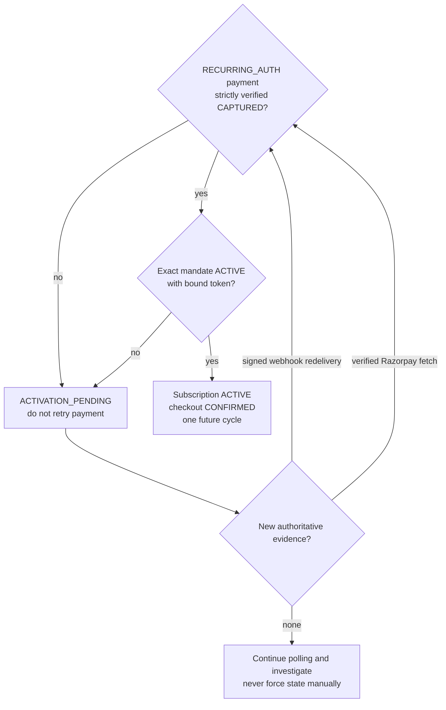

# Uppermost Razorpay Live + Renewal Runbook

**Actual-code version:** 5 October 2026
**Production base:** `https://uppermost-dashboard-latest-orcin.vercel.app`

## Live webhook configuration

Configure Razorpay Live webhook URL:

`https://uppermost-dashboard-latest-orcin.vercel.app/api/webhooks/razorpay`

Enable exactly:

- `payment.authorized`
- `payment.captured`
- `payment.failed`
- `token.confirmed`
- `token.rejected`
- `token.cancelled`
- `token.paused`

Do not enable `subscription.authenticated`, `subscription.activated`, `subscription.charged`, `subscription.pending`, `subscription.halted`, `subscription.cancelled`, `subscription.paused`, `subscription.resumed`, `subscription.completed`, or `subscription.updated`. Uppermost does not use Razorpay Plans/Subscriptions. `order.paid` is unnecessary; if delivered, it is a persisted signed no-op.

## Razorpay APIs used

- `POST /customers`
- `POST /orders` for one-time and initial `as_presented` recurring authorization
- `POST /orders` with `notification.token_id` and `notification.payment_after` for a renewal's pre-debit lifecycle
- `GET /payments/{payment_id}` for browser-return verification
- `POST /payments/create/recurring` with `recurring: true` for a due debit
- `GET /orders/{order_id}/payments` before a bounded retry/reconciliation

Base URL is `https://api.razorpay.com/v1` through `RAZORPAY_API_BASE_URL`.

## Production environment

Required in Vercel Production without printing values:

- `NEXT_PUBLIC_SUPABASE_URL`
- `NEXT_PUBLIC_SUPABASE_ANON_KEY`
- `SUPABASE_SERVICE_ROLE_KEY`
- `COMMERCE_TOKEN_PEPPER`
- `COMMERCE_QUOTE_TTL_SECONDS`
- `COMMERCE_MANDATE_BUFFER_PAISE`
- `COMMERCE_ALLOWED_ORIGINS`
- `COMMERCE_INVENTORY_SOURCE`
- `COMMERCE_CRON_SECRET`
- `CRON_SECRET` set to the same value as `COMMERCE_CRON_SECRET` so Vercel supplies the correct Bearer token
- `RAZORPAY_KEY_ID`
- `RAZORPAY_KEY_SECRET`
- `RAZORPAY_WEBHOOK_SECRET`
- `RAZORPAY_API_BASE_URL=https://api.razorpay.com/v1`
- `RAZORPAY_MANDATE_EXPIRY_DAYS`
- `SHIPROCKET_TOKEN` or `SHIPROCKET_EMAIL` + `SHIPROCKET_PASSWORD`
- `SHIPROCKET_PICKUP_POSTCODE`
- `SHIPROCKET_PICKUP_LOCATION`
- `SHIPROCKET_WEBHOOK_SECRET`
- `SHIPROCKET_API_BASE_URL`

All secrets are server-only. Framer receives only the Razorpay public key ID and checkout-safe data.

## Deployment sequence

**Migration status (5 October 2026):** the operator confirms `supabase/migrations/20261005090000_harden_razorpay_recurring_architecture.sql` has already been applied. The embedded confirmed-token activation fix is code-only; do not rerun the migration merely for this deployment. Verify the recorded migration and installed functions/constraints instead.

1. Confirm the hardening migration is present in Production migration history.
2. Confirm RLS remains enabled and only `service_role` can execute the claim/transition RPCs.
3. Configure both cron variables and Razorpay Live variables in Vercel Production.
4. Deploy Next.js.
5. Configure the exact Razorpay events above and the matching Live webhook secret.
6. Run the unauthorized/authorized cron tests below.
7. Redeliver the affected Test `payment.captured` event, then run one-time, embedded-confirmation, token-first, captured-first and renewal smoke tests.
8. Confirm one payment attempt, order, message and shipment per successful cycle.

## Recurring activation operator model



Positive mandate evidence is either a correlated standalone `token.confirmed` or a strictly validated capture/fetch containing the exact embedded token with `recurring = true` and `recurring_details.status = confirmed`. A token ID alone is not positive evidence.

### Event-order outcomes

| Provider delivery | Expected result |
|---|---|
| capture with embedded confirmed token | capture, bind token, central mandate transition, activate immediately |
| capture without confirmed token, then `token.confirmed` | first response remains `ACTIVATION_PENDING`; later event activates |
| `token.confirmed`, then capture | mandate becomes active if correlated; activation waits for capture; an initially uncorrelatable token event is replayed after binding |
| duplicate capture and/or duplicate token confirmation | same final state, same `started_at`, same `next_charge_at`, exactly one cycle 2 |
| embedded paused/rejected/cancelled | central negative transition; never activate |
| embedded unknown status or provider binding conflict | fail closed and persist diagnostic error |

## API impact

### Modified

| Method/path | Purpose/auth | Frontend impact |
|---|---|---|
| `POST /api/webhooks/razorpay` | Razorpay only; raw-body HMAC in `X-Razorpay-Signature`, event identity in `x-razorpay-event-id` | None |
| `POST /api/internal/renewals/run` | Legacy internal alias; `Authorization: Bearer <COMMERCE_CRON_SECRET>` | None |

### Newly created

| Method/path | Purpose/auth | Frontend impact |
|---|---|---|
| `GET /api/internal/cron/renewals` | Canonical daily Vercel Hobby Cron wake-up; Bearer secret | None |

### Behavior changed, route unchanged

| Method/path | Change |
|---|---|
| `POST /api/checkout/prepare` | Persists Razorpay order correlation on a pending recurring mandate; response is unchanged |
| `POST /api/payments/verify` | Uses centralized strict order/payment/amount/currency and monotonic reconciliation; a verified fetched payment may also supply embedded confirmed recurring-token evidence; request/response unchanged |
| `GET /api/checkout/status` | Can remain `ACTIVATION_PENDING` until both capture and token confirmation; response schema unchanged |
| `GET /api/experience` | Reflects the hardened persisted state; response schema unchanged |

### Audited only

- `GET /api/commerce/catalog`
- `POST /api/commerce/quote`
- `POST /api/shipping/serviceability`
- `POST /api/webhooks/carrier-events`

The exact public JSON contract remains in `docs/FRAMER_COMMERCE_CONTRACT.md`. No Framer request shape changed.

## Curl handbook

There is no general commerce health route.

### Authoritative quote

```bash
curl -i 'https://uppermost-dashboard-latest-orcin.vercel.app/api/commerce/quote' \
  -H 'Content-Type: application/json' \
  -H 'Origin: https://www.uppermost.store' \
  --data '{
    "guest_session_id":"<SESSION_ID>",
    "postal_code":"110001",
    "items":[
      {"line_id":"gir","sku":"GIR-1000","qty":1,"purchase_mode":"SUBSCRIPTION","interval_days":30},
      {"line_id":"murrah","sku":"MURRAH-1000","qty":1,"purchase_mode":"BUY_ONCE"}
    ]
  }'
```

Success is HTTP 201 and includes `quote_id`, `quote_token`, `valid_until`, `initial`, `recurring_groups`, and shipping context. Money is integer paise.

### Shipping serviceability

```bash
curl -i 'https://uppermost-dashboard-latest-orcin.vercel.app/api/shipping/serviceability' \
  -H 'Content-Type: application/json' \
  -H 'Origin: https://www.uppermost.store' \
  --data '{
    "postal_code":"110001",
    "items":[{"line_id":"gir","sku":"GIR-0500","qty":1,"purchase_mode":"BUY_ONCE"}]
  }'
```

Success is HTTP 200. An unserviceable pincode returns the normalized error envelope.

### Checkout prepare

```bash
curl -i 'https://uppermost-dashboard-latest-orcin.vercel.app/api/checkout/prepare' \
  -H 'Content-Type: application/json' \
  -H 'Origin: https://www.uppermost.store' \
  -H 'Idempotency-Key: <IDEMPOTENCY_KEY>' \
  --data '{
    "guest_session_id":"<SESSION_ID>",
    "quote_id":"<QUOTE_ID>",
    "quote_token":"<QUOTE_TOKEN>",
    "customer":{"name":"Test Customer","email":"test@example.com","phone":"+919999999999"},
    "shipping_address":{"line1":"Test address","city":"Delhi","state":"Delhi","postal_code":"110001","country":"IN"},
    "billing_same_as_shipping":true,
    "recurring_consent":{"accepted":true,"version":"v1.0"}
  }'
```

Success is HTTP 201 with unchanged Framer-safe Razorpay checkout payload. Omit `recurring_consent` for a pure buy-once quote.

### Payment verify

```bash
curl -i 'https://uppermost-dashboard-latest-orcin.vercel.app/api/payments/verify' \
  -H 'Content-Type: application/json' \
  -H 'Origin: https://www.uppermost.store' \
  -H 'Idempotency-Key: <IDEMPOTENCY_KEY>' \
  --data '{
    "checkout_session_id":"<CHECKOUT_SESSION_ID>",
    "razorpay_payment_id":"pay_...",
    "razorpay_order_id":"order_...",
    "razorpay_signature":"<RAZORPAY_CHECKOUT_SIGNATURE>"
  }'
```

Success is HTTP 200 in checkout-status shape. Signature/order/payment/amount/currency mismatch cannot confirm payment. For `RECURRING_AUTH`, a fetched payment containing `token.id`, `token.recurring = true`, and `token.recurring_details.status = confirmed` activates the same centralized mandate transition used by `token.confirmed`. A token ID without that explicit status remains `ACTIVATION_PENDING`.

### Checkout polling

```bash
curl -i 'https://uppermost-dashboard-latest-orcin.vercel.app/api/checkout/status?session_id=<CHECKOUT_SESSION_ID>' \
  -H 'Origin: https://www.uppermost.store'
```

Success is HTTP 200. `ACTIVATION_PENDING` means capture succeeded but recurring token is not yet confirmed; the browser must poll rather than start a second payment.

### Experience fetch

```bash
curl -i 'https://uppermost-dashboard-latest-orcin.vercel.app/api/experience?token=<EXPERIENCE_TOKEN>' \
  -H 'Origin: https://www.uppermost.store'
```

Success is HTTP 200 with safe order, exact paid items, shipment/timeline, messages and subscription projection. Provider IDs/tokens and full PII are excluded.

### Authorized renewal cron

```bash
curl -i 'https://uppermost-dashboard-latest-orcin.vercel.app/api/internal/cron/renewals' \
  -H 'Authorization: Bearer <CRON_SECRET>'
```

Success is HTTP 200 with notification/debit claim counts and results.

The committed schedule is `0 0 * * *` UTC because Hobby rejects schedules more frequent than daily. The scheduler locks notification work 50 hours before due so the daily job still supplies at least 24 hours of notice. Upgrade the project to Pro before higher subscription volume to use hourly execution and tighter debit timing.

### Unauthorized renewal cron

```bash
curl -i 'https://uppermost-dashboard-latest-orcin.vercel.app/api/internal/cron/renewals'
```

Expected: HTTP 401 with `{"ok":false,"error":{"code":"UNAUTHORIZED","message":"Unauthorized."}}`.

### Signed Razorpay webhook test

Do this only against Test mode/test records or a local/staging deployment. The script signs the exact bytes it sends; it never uses a fake signature. Set `RAZORPAY_WEBHOOK_SECRET` in the shell without committing it.

```bash
RAZORPAY_WEBHOOK_SECRET='<RAZORPAY_WEBHOOK_SECRET>' \
WEBHOOK_EVENT='payment.captured' \
node <<'NODE'
const crypto = require('crypto')
const event = process.env.WEBHOOK_EVENT
const entities = {
  'payment.captured': {
    event,
    created_at: Math.floor(Date.now() / 1000),
    payload: { payment: { entity: {
      id: 'pay_<EXISTING_TEST_PAYMENT_ID>',
      order_id: 'order_<EXISTING_TEST_ORDER_ID>',
      status: 'captured', amount: 100, currency: 'INR',
      token_id: 'token_<EXISTING_TEST_TOKEN_ID>',
      token: {
        id: 'token_<EXISTING_TEST_TOKEN_ID>',
        recurring: true,
        recurring_details: { status: 'confirmed' }
      }
    } } }
  },
  'token.confirmed': {
    event,
    created_at: Math.floor(Date.now() / 1000),
    payload: { token: { entity: {
      id: 'token_<EXISTING_TEST_TOKEN_ID>',
      payment_id: 'pay_<EXISTING_TEST_PAYMENT_ID>',
      order_id: 'order_<EXISTING_TEST_ORDER_ID>',
      recurring_details: { status: 'confirmed' }
    } } }
  }
}
const body = JSON.stringify(entities[event])
const signature = crypto.createHmac('sha256', process.env.RAZORPAY_WEBHOOK_SECRET).update(body).digest('hex')
fetch('https://uppermost-dashboard-latest-orcin.vercel.app/api/webhooks/razorpay', {
  method: 'POST',
  headers: {
    'content-type': 'application/json',
    'x-razorpay-signature': signature,
    'x-razorpay-event-id': `manual-${event}-${crypto.randomUUID()}`
  },
  body
}).then(async response => {
  console.log(response.status, await response.text())
  if (!response.ok) process.exitCode = 1
})
NODE
```

Set `WEBHOOK_EVENT='token.confirmed'` to test the second exact supported payload. Values must reference an actual matching Test payment/order/token; otherwise strict correlation deliberately returns an error.

No manual reconciliation route exists. Ambiguous renewals remain `RECONCILIATION_PENDING` for webhook/provider-fetch recovery and operator investigation; do not trigger another debit manually without proving the first did not succeed.

### Safe Razorpay HTTP failure diagnostics

Every non-successful response from the centralized Razorpay client writes one structured server-only log. It contains only `provider`, logical `operation`, HTTP `method`, Razorpay API `path`, response `status`, the allowlisted `provider_error` fields (`code`, `description`, `source`, `step`, `reason`, `field`), and explicitly selected safe identifiers/amount/currency. It never logs request headers, Authorization, API secrets, customer contact details, request bodies, or the complete provider response.

Renewal-cycle `last_error` stores the same allowlisted provider fields with `stage`, `provider: RAZORPAY`, and `http_status`. Malformed or non-JSON bodies become a generic description and null provider fields; raw HTML/text is neither logged nor stored. This diagnostic behavior does not change retry or state classification: provider-order HTTP 4xx remains fail-closed as `REAUTH_REQUIRED` until the captured error identifies the separate business fix.

### Renewal order recovery invariant

The renewal notification worker discovers the local order by the unique `orders.subscription_cycle_id`, not only by `subscription_cycles.order_id`. Order creation/recovery, immutable snapshot validation, child snapshot creation for a new order, and the cycle link are one short Postgres transaction. Therefore a provider-order failure retains one reusable local order and a durable `cycle.order_id`; a retry does not reprice or insert another order. If an older deployment already left a valid order with a null cycle link, the next deliberately claimed notification retry recovers that exact order and repairs the link without deleting or rewriting it.

Provider success uses a second atomic create-or-recover operation for the unique cycle payment attempt and provider-order link. A repeated worker result with the same order/provider order/amount/currency is a no-op; any material mismatch fails closed. Concurrent cron invocations remain protected by `FOR UPDATE SKIP LOCKED`, cycle row locks, and the unique order/payment-attempt indexes. Do not manually issue a second provider order while a provider result is ambiguous.

Before deploying this recovery path, apply `20261005113000_recover_renewal_orders_by_cycle.sql`. The migration adds service-role-only database functions; it does not delete, rewrite, or clean existing renewal orders.

## Single-query checkout audit

Use this read-only query in Supabase SQL Editor to inspect a checkout end to end. It derives customer and subscription scope from the checkout/order rather than relying on a separately pasted customer ID, which avoids accidentally mixing two transactions. Replace only the two IDs in `target`.

The output is an operator-only diagnostic and can contain PII, provider IDs, embedded recurring-token metadata, raw webhook payloads, addresses, and message content. Do not paste the raw result into Framer, analytics, tickets, chat, or an AI system. Redact it first and never share token values or secrets.

```sql
with target as (
  select
    '<CHECKOUT_SESSION_ID>'::uuid as checkout_session_id,
    '<ORDER_ID>'::uuid as order_id
),
scope as (
  select
    t.checkout_session_id,
    t.order_id,
    o.customer_id,
    o.subscription_id
  from target t
  join public.orders o on o.id = t.order_id
  where o.checkout_session_id = t.checkout_session_id
),
attempts as (
  select pa.*
  from public.payment_attempts pa, scope s
  where pa.checkout_session_id = s.checkout_session_id
     or pa.order_id = s.order_id
),
subscriptions_in_scope as (
  select sub.*
  from public.subscriptions sub, scope s
  where sub.id = s.subscription_id
     or (s.subscription_id is null and sub.customer_id = s.customer_id)
),
mandates_in_scope as (
  select rm.*
  from public.recurring_mandates rm
  where rm.subscription_id in (select id from subscriptions_in_scope)
),
shipments_in_scope as (
  select sh.*
  from public.shipments sh, scope s
  where sh.order_id = s.order_id
),
messages_in_scope as (
  select cm.*
  from public.customer_messages cm, scope s
  where cm.order_id = s.order_id
     or cm.subscription_id in (select id from subscriptions_in_scope)
     or cm.payment_attempt_id in (select id from attempts)
     or cm.shipment_id in (select id from shipments_in_scope)
)
select jsonb_build_object(
  'checkout_session', (
    select to_jsonb(cs) from public.checkout_sessions cs, scope s
    where cs.id = s.checkout_session_id
  ),
  'initial_order', (
    select to_jsonb(o) from public.orders o, scope s where o.id = s.order_id
  ),
  'order_items', coalesce((
    select jsonb_agg(to_jsonb(oi) order by oi.created_at)
    from public.order_items oi, scope s where oi.order_id = s.order_id
  ), '[]'::jsonb),
  'payment_attempts', coalesce((
    select jsonb_agg(to_jsonb(pa) order by pa.created_at) from attempts pa
  ), '[]'::jsonb),
  'payment_events', coalesce((
    select jsonb_agg(to_jsonb(pe) order by pe.created_at)
    from public.payment_events pe
    where pe.payment_attempt_id in (select id from attempts)
       or pe.provider_order_id in (select provider_order_id from attempts)
       or pe.provider_payment_id in (
         select provider_payment_id from attempts where provider_payment_id is not null
       )
       or pe.raw_payload #>> '{payload,token,entity,id}' in (
         select provider_token_id from mandates_in_scope where provider_token_id is not null
       )
  ), '[]'::jsonb),
  'subscriptions', coalesce((
    select jsonb_agg(to_jsonb(sub) order by sub.created_at)
    from subscriptions_in_scope sub
  ), '[]'::jsonb),
  'recurring_mandates', coalesce((
    select jsonb_agg(to_jsonb(rm) order by rm.created_at) from mandates_in_scope rm
  ), '[]'::jsonb),
  'subscription_items', coalesce((
    select jsonb_agg(to_jsonb(si) order by si.created_at)
    from public.subscription_items si
    where si.subscription_id in (select id from subscriptions_in_scope)
  ), '[]'::jsonb),
  'subscription_cycles', coalesce((
    select jsonb_agg(to_jsonb(sc) order by sc.created_at)
    from public.subscription_cycles sc
    where sc.subscription_id in (select id from subscriptions_in_scope)
  ), '[]'::jsonb),
  'order_adjustments', coalesce((
    select jsonb_agg(to_jsonb(oa) order by oa.created_at)
    from public.order_adjustments oa, scope s where oa.order_id = s.order_id
  ), '[]'::jsonb),
  'order_benefits', coalesce((
    select jsonb_agg(to_jsonb(ob) order by ob.created_at)
    from public.order_benefits ob, scope s where ob.order_id = s.order_id
  ), '[]'::jsonb),
  'shipments', coalesce((
    select jsonb_agg(to_jsonb(sh) order by sh.created_at) from shipments_in_scope sh
  ), '[]'::jsonb),
  'tracking_events', coalesce((
    select jsonb_agg(to_jsonb(te) order by te.occurred_at)
    from public.tracking_events te
    where te.shipment_id in (select id from shipments_in_scope)
  ), '[]'::jsonb),
  'customer_messages', coalesce((
    select jsonb_agg(to_jsonb(cm) order by cm.created_at) from messages_in_scope cm
  ), '[]'::jsonb),
  'message_deliveries', coalesce((
    select jsonb_agg(to_jsonb(md) order by md.created_at)
    from public.message_deliveries md
    where md.customer_message_id in (select id from messages_in_scope)
  ), '[]'::jsonb),
  'idempotency_records', coalesce((
    select jsonb_agg(to_jsonb(ir) order by ir.created_at)
    from public.idempotency_records ir, scope s
    where ir.response_reference_id in (s.checkout_session_id, s.order_id)
  ), '[]'::jsonb)
) as commerce_audit;
```

For a successfully activated initial recurring checkout, verify all of these together:

- payment attempt `status = CAPTURED` and `normalized_state = CONFIRMED`;
- mandate `status = ACTIVE` with the expected provider token/order/payment IDs;
- subscription `status = ACTIVE`, non-null `started_at`, and non-null `next_charge_at`;
- checkout `state = CONFIRMED`;
- exactly one future cycle (normally cycle 2) for the subscription;
- webhook event is `PROCESSED`, not silently absent or indefinitely `PROCESSING`;
- no duplicate order, payment attempt, cycle, customer message, or shipment.

## Production validation checklist

- Hardening migration is present in Production migration history; it is not rerun for the code-only embedded-token fix.
- Invalid webhook HMAC returns 401 without persistence.
- Duplicate processed event returns idempotent 200.
- Failed/stale event is reclaimable.
- Captured-first with an embedded confirmed recurring token activates without requiring a separate `token.confirmed` delivery.
- Captured-first without embedded confirmation remains `ACTIVATION_PENDING` until standalone `token.confirmed` arrives.
- Token-first and captured-later converges to the same active state.
- Duplicate capture plus duplicate/later token confirmation creates only one future cycle and does not advance `next_charge_at` twice.
- Late `payment.failed` cannot downgrade capture.
- Token payload uses `recurring_details.status`; cancelled remains terminal.
- Hourly cron receives Bearer auth; unauthorized request is 401.
- Notification occurs before scheduled debit and cycle amount is locked.
- Above-cap cycle makes no provider debit and becomes `REAUTH_REQUIRED`.
- Ambiguous response does not create a blind second debit.
- Mixed cart renews subscribed lines only.
- One captured cycle yields exactly one order, message and Shiprocket shipment.
- `next_charge_at` advances only after capture from the previous due timestamp.
