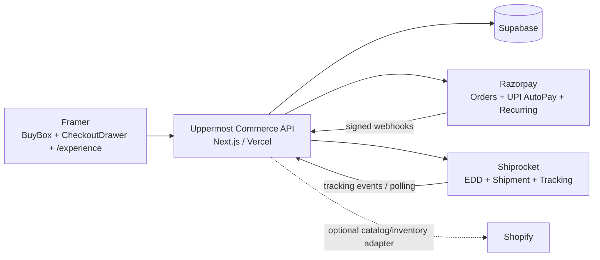
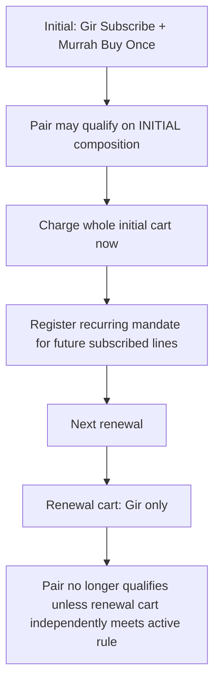
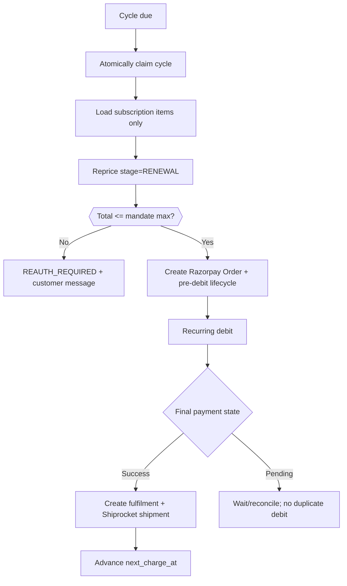

# Uppermost® Commerce V1 — Architecture & Implementation Blueprint

**Document status:** FROZEN BASELINE  
**Version:** 1.1
**Date:** 25 September 2026
**Audience:** CXO / Product / Engineering / Framer / Operations / Growth  
**Canonical repository path:** `docs/UPPERMOST_COMMERCE_ARCHITECTURE.md`

> This document is the durable source of truth for Uppermost commerce V1. Future implementation changes should update this file before changing the architecture.

## Executive Summary

Uppermost will keep the complete customer-facing buying experience inside Framer while using a thin secure commerce backend for all authoritative pricing, payment, subscription, shipping and state transitions.

- **Framer:** product experience, cart/checkout drawer, address, pincode/EDD, consent, Razorpay launch, inline payment state, and native `/experience` tracking page.
- **Next.js/Vercel:** public catalog projection, secure quote engine, promotion rules, checkout orchestration, Razorpay integration, renewals, Shiprocket proxy, messaging, idempotency and webhooks.
- **Supabase:** source of truth for commerce data, customers, addresses, orders, subscription items, mandates, messages, tracking and eventually Auth/RLS-backed customer account.
- **Razorpay:** money movement only — one-time orders, first recurring authorization payment, UPI AutoPay mandate/token, recurring debits, payment/webhook state.
- **Shiprocket:** serviceability, EDD, shipment creation, courier/AWB and tracking.
- **Shopify:** optional catalog/inventory reference during migration; Shopify Checkout is removed from the new purchase path.
- **fastrr:** excluded from V1 to avoid multiple pricing authorities and preserve the Framer-first experience.

### Core commercial model

1. Cart purchase mode is **per line item**, so a single order can contain Gir as subscription and Murrah as buy-once.
2. The initial payment charges the **whole initial cart immediately**.
3. Future renewal carts contain **subscription lines only**.
4. Subscription amount is **recalculated on every renewal** using current product price plus only promotions/entitlements that are eligible for that subscriber and lifecycle stage.
5. Razorpay mandate uses a **maximum authorised debit**, with configurable headroom. If a renewal exceeds the cap, no debit occurs; re-authorization is required.
6. New promotions do **not** automatically leak to existing subscribers unless explicitly configured.
7. Pair/bundle eligibility is re-evaluated against the cart being priced. A Gir subscription + Murrah buy-once can receive Pair benefit initially, but the renewal Gir-only cart does not.

## Executive Architecture



## Customer Experience

```mermaid
flowchart LR
  PDP[Product Page / BuyBox] --> ADD[Add to Order]
  ADD --> DRAWER[Same-page Checkout Drawer]
  DRAWER --> ADDR[Contact + Address once]
  ADDR --> EDD[Pincode + live EDD]
  EDD --> QUOTE[Server quote + offers + mandate cap]
  QUOTE --> RP[Razorpay Checkout
Desktop QR / Mobile Intent]
  RP --> VERIFY[Inline Confirming state]
  VERIFY --> EXP[/experience?t=secure-token]
  EXP --> TRACK[Live shipment timeline]
```

## Mixed Cart Example



## Frozen Platform Responsibilities

| Platform | Responsibility | Must not own |
|---|---|---|
| Framer | All visible UI, cart drawer, address, pincode/EDD display, consent, payment launch, experience/tracking page | Payment secrets, authoritative price, mandate token |
| Next.js/Vercel | Pricing, promotions, quote security, checkout, renewals, integrations, normalized states | Long-term customer-facing layout |
| Supabase | Commerce state, customers, orders, subscriptions, mandates, messages, tracking, Auth/RLS | Client-trusted pricing |
| Razorpay | One-time payment, recurring authorization, UPI QR/Intent, token/mandate, later recurring debit | Subscription schedule, cart rules, offer logic |
| Shiprocket | Serviceability, EDD, shipment, courier/AWB, tracking | Checkout pricing |
| Shopify | Optional product/inventory sync reference | New checkout/payment authority |

## Current Live Offer Baseline

- Gir 1 L: standard ₹7,500; early-bird ₹7,000 through 4 Oct 2026.
- Murrah 1 L: standard ₹5,500; early-bird ₹5,000 through 4 Oct 2026.
- The Pair: qualifying Gir + Murrah combination receives configured Pair benefit; global promotion validity is one calendar year from configured start/end dates.
- Subscription benefit: ₹500 begins from shipment/cycle #2; never applies to the first subscription charge.
- Current shipping: free across India.
- All dates, values and eligibility are server configuration; none are hard-coded into Framer as payment authority.

## Promotion Engine

Promotions are modeled as **conditions → eligibility → actions**, not as one-off discount flags.

Supported conditions: date window, SKU/product/variant, required bundle composition, minimum cart value, minimum quantity, initial/renewal lifecycle, buy-once/subscription/mixed purchase shape, cycle number, new/existing subscriber, customer/subscription cohort, explicit entitlement, first/returning order, usage limit, stacking priority/group.

Supported actions: amount off, percent off, fixed bundle price, free shipping, shipping discount, free product, free gift wrap, Buy X Get Y, and informational/non-monetary benefit.

`promotion_entitlements` remains a separate table so multiple benefits can coexist, expire, be grandfathered, revoked, or have remaining-use counters.

## Cart & Subscription Model

```ts
type CartLine = {{
  lineId: string
  sku: string
  qty: number
  purchaseMode: "BUY_ONCE" | "SUBSCRIPTION"
  intervalDays?: 15 | 30 | 60
}}
```

V1 constraint: all subscription lines in one checkout use one common interval. The data model remains extensible to multiple recurring groups later.

### Initial vs renewal pricing

- **INITIAL:** price every line in the checkout, including one-time items.
- **RENEWAL:** build a new pricing cart from subscription items only.
- Pair/bundle promotions are re-evaluated each time against the current evaluated cart.
- Current public promotions are not automatically granted to older subscribers.
- Grandfathered or explicit subscriber rights are read from `promotion_entitlements`.

## Razorpay Variable Recurring Model

Uppermost does not use Razorpay Plans or Razorpay Subscriptions for V1. Uppermost owns the business subscription; Razorpay owns the financial mandate/payment rail.

```mermaid
flowchart LR
  U[Uppermost subscription] --> C[Razorpay Customer]
  C --> A[Initial recurring-authorisation Order]
  A --> T[UPI AutoPay token / mandate]
  T --> N[Uppermost scheduler]
  N --> Q[Recalculate renewal]
  Q --> O[New Razorpay Order]
  O --> D[/payments/create/recurring]
```

Initial cart is charged at authorization time. For mixed carts, the initial amount can include buy-once items, while future renewal projection includes only subscription items. Mandate maximum is server-calculated as the greater of the initial checkout total and the projected recurring total plus a configurable trust-preserving buffer.

If a future debit exceeds the mandate maximum: **do not debit; set REAUTH_REQUIRED; create a customer action message.**

## Payment UX & State Normalization

Raw Razorpay technical errors are stored internally. Framer receives normalized states and customer-ready messages only:

- `CHECKOUT_READY`
- `AUTHORIZING`
- `VERIFYING`
- `CONFIRMED`
- `ACTIVATION_PENDING`
- `PENDING`
- `FAILED_RETRYABLE`
- `INSUFFICIENT_FUNDS`
- `MANDATE_ACTION_REQUIRED`
- `MANDATE_PAUSED`
- `MANDATE_EXPIRED`
- `CAP_EXCEEDED`
- `CUSTOMER_CANCELLED`
- `QUOTE_CHANGED`
- `QUOTE_EXPIRED`
- `SYSTEM_ERROR`

The browser success callback is never sufficient for fulfillment. Signature verification and webhook/server reconciliation are authoritative.

## Checkout Drawer

There is no separate cart page in V1. The system has **cart state without a cart page**.

`BuyBox.tsx` edits the selected lines and opens `CheckoutDrawer.tsx`. The drawer provides selection/cart, complementary expression upsell, per-line Buy Once/Subscribe, contact, address, pincode/EDD, order summary, subscription consent and Razorpay launch.

Customer address is entered **once in Framer** and reused for Shiprocket and recurring fulfillment. Razorpay receives name/email/contact prefill where appropriate. Razorpay-managed QR/Intent is used; Uppermost does not generate its own payment QR.

## Native Framer /experience Page

After verification there is one navigation to `/experience?t=<high-entropy-token>`. This page replaces a generic thank-you page and becomes the customer's live order journey.

It displays:
- order confirmation and safe reference
- current shipment stage
- expected delivery window
- live tracking timeline
- latest scan/location when available
- items and paid pricing snapshot
- non-monetary benefits such as gift wrap
- subscription-only future selection, interval, next billing date, projected amount and mandate cap
- action-required messaging for mandate/renewal issues

The page itself is native Framer. A focused code component may render dynamic timeline data; the page is not a standalone React route.

## Secure Quote & Idempotency Model

A quote is valid only when both a high-entropy `quote_id` and `quote_token` match a server record. It is bound to guest/customer identity, cart fingerprint, line modes, interval, currency, pricing/promotion versions, shipping context, price snapshot, expiry and status.

Checkout preparation always re-prices server-side. Forged, expired, replayed or mismatched quotes are rejected. Price changes return `QUOTE_CHANGED` and a fresh quote; the system never silently charges a new amount.

All money-changing endpoints require an `Idempotency-Key`. Same key + same request returns the same result. Same key + changed request returns `409 IDEMPOTENCY_CONFLICT`.

## Public Catalog vs Transactional Quote Authority

`GET /api/commerce/catalog` is the public read-only authority for product-display state in Framer: products and variants, active/sellable state, standard price, a current display-price snapshot, release availability and explicitly public promotion copy/windows. It is a short-lived snapshot and never authorizes a charge or promises that an offer will apply to a particular cart.

`POST /api/commerce/quote` remains the final transactional authority for payable totals, promotion eligibility, Pair qualification, subscription benefits, entitlements and current inventory validation. Framer must refresh a quote before checkout and must render the returned quote when catalog display state and transactional state differ.

Release inventory is stored independently from physical/on-hand inventory. A release records capacity and committed quantity; the public remaining amount is `max(release_capacity - release_committed, 0)`, constrained by physical sellable inventory when that value is known. Raw warehouse metadata and private promotion conditions are never returned by the public catalog route.

## Core API Surface

| Endpoint | Purpose |
|---|---|
| `GET /api/commerce/catalog` | public product-display state, release availability and safe offer metadata |
| `POST /api/commerce/quote` | authoritative cart price, promotions, recurring projection |
| `POST /api/shipping/serviceability` | pincode eligibility, live EDD, shipping amount |
| `POST /api/checkout/prepare` | unified one-time / subscription / mixed checkout preparation |
| `POST /api/payments/verify` | server-side payment verification |
| `GET /api/checkout/status?session_id=` | pending / late payment reconciliation |
| `POST /api/webhooks/razorpay` | signed payment/mandate callbacks |
| `POST /api/webhooks/shiprocket` | shipment/tracking updates where supported |
| `GET /api/experience?token=` | safe customer-facing order/tracking/subscription data |
| `GET/POST /api/customer/addresses` | saved Uppermost addresses |
| internal protected renewal runner | due subscription cycles |

## Unified Checkout Prepare

`POST /api/checkout/prepare` handles all shapes:

- zero subscription lines → normal Razorpay Order
- one or more subscription lines → recurring authorization Order + initial whole-cart payment

It validates secure quote, re-prices, resolves/creates customer, snapshots address and items, creates an internal Uppermost order in `PAYMENT_PENDING`, then creates the relevant Razorpay order. The response contains only public checkout data.

## Renewal Sequence



## Customer Messaging

Three dedicated layers:

- `message_templates`: centrally managed message key/channel/version/copy
- `customer_messages`: durable in-app/customer action records linked to order/subscription/payment/shipment
- `message_deliveries`: email/SMS/in-app delivery attempts and provider status

A code fallback catalog (`lib/commerce/messages.ts`) guarantees safe copy if a DB template is unavailable. DB copy can be changed without redeploying Framer.

## Data Domains

Core tables/adaptations:

`products`, `product_variants`, `product_variant_releases`, `promotions`, `promotion_entitlements`, `carts`, `cart_items`, `commerce_quotes`, `customers`, `customer_addresses`, `checkout_sessions`, `orders`, `order_items`, `order_adjustments`, `order_benefits`, `subscriptions`, `subscription_items`, `subscription_cycles`, `recurring_mandates`, `payment_attempts`, `payment_events`, `shipments`, `tracking_events`, `message_templates`, `customer_messages`, `message_deliveries`, `idempotency_records`.

Money should be stored as integer paise wherever practical.

## Security Principles

- Never trust frontend price, discount, shipping, weight, dimensions or quote id alone.
- Never expose Razorpay key secret, webhook secret, recurring token, Shiprocket credentials or Supabase service role.
- Restrict production CORS to Uppermost domains and explicitly configured preview origins.
- Verify Razorpay signatures/webhooks and process idempotently.
- Use high-entropy public experience tokens; never authorize tracking from sequential order number alone.
- Snapshot checkout address and commercial terms for audit/reconciliation.
- Apply RLS to exposed Supabase tables and keep sensitive payment/mandate records server-only.

## Authentication Roadmap

Checkout remains guest-friendly. Account/login should not block purchase. Supabase Auth is the preferred identity layer for later customer account features, supporting Google, email OTP/magic-link and phone OTP. Phone OTP in India should be enabled only after compliant SMS/DLT setup is ready.

## Existing BuyBox Migration Notes

The current BuyBox already has the visual 15/30/60 interval control, but purchase frequency is global rather than per line; Pair and subscription calculations are performed client-side; one-time checkout currently creates a Shopify Storefront cart and redirects to Shopify; subscription is still represented as a reserve/waitlist flow. The new architecture preserves the visual design while moving commerce authority to the backend and opening a same-page Checkout Drawer.

## Rollout Order

1. Database migrations + authoritative catalog/promotion seed.
2. Pricing engine + quote security/idempotency.
3. Shiprocket serviceability/EDD.
4. Unified checkout prepare + normal Razorpay one-time path.
5. Recurring authorization path and mandate persistence.
6. Payment verification + webhooks + normalized messaging.
7. Framer cart state + Checkout Drawer + BuyBox refactor.
8. Native Framer `/experience` page + live tracking API.
9. Renewal scheduler + pre-debit lifecycle + recurring debit.
10. Test-mode matrix and production cutover.

## Must-Pass Test Matrix

- Gir buy-once.
- Gir subscription.
- Gir subscription + Murrah buy-once.
- Gir + Murrah both subscribed.
- Initial mixed cart Pair qualification.
- Renewal Gir-only no Pair qualification.
- Pair promotion expiry after configured one-year window.
- Early-bird expiry.
- Subscription benefit absent on cycle 1 and present on cycle 2.
- New-subscriber promo does not leak to existing subscriber.
- Minimum-cart promotion.
- Free gift wrap benefit.
- forged/wrong/expired/replayed quote.
- duplicate prepare and idempotency conflict.
- duplicate webhook.
- amount above mandate cap → no debit / re-auth.
- payment pending/late success → no double payment.
- Shiprocket unavailable → payment/order state remains safe.
- Experience token cannot expose another customer’s order.

## External Platform Constraints — Validate in Test Mode

1. Razorpay UPI AutoPay authorization requires Customer + Order + authorization transaction; recurring tokens are linked to the customer.
2. UPI Collect for new AutoPay registrations is deprecated for most new registrations from 28 Feb 2026; Intent/QR is the expected registration path.
3. Razorpay mandate `max_amount` is the maximum allowed single debit and should remain close enough to the expected debit to maintain customer trust.
4. Supported recurring frequency includes `as_presented`; Uppermost uses this for merchant-managed exact 15/30/60-day scheduling subject to live-account confirmation.
5. Subsequent debits must create a new Razorpay Order and then execute a recurring payment using the customer/token, following the pre-debit notification lifecycle.
6. Mixed initial payment + recurring mandate behavior must be proven end-to-end in Razorpay Test Mode before production.
7. Desktop recurring registration should use Razorpay-managed QR where Intent is unavailable; mobile should use the supported Intent flow.

## Decision Log — Frozen V1

- Framer-first customer experience: **YES**.
- Same-page right-side checkout drawer: **YES**.
- Separate traditional cart page: **NO**.
- Cart state/data model: **YES**.
- Mixed buy-once + subscription lines: **YES**.
- Razorpay Plans/Subscriptions API: **NO**.
- Razorpay Recurring Payments/mandate token: **YES**.
- Dynamic amount every renewal: **YES**.
- Customer re-consent every price change below mandate cap: **NO**; mandate and commercial disclosures govern, with re-auth when cap exceeded.
- Configurable mandate headroom ~₹2k–₹3k: **YES**, server policy, visibly disclosed.
- First subscription payment collected immediately: **YES**.
- Address entered once in Framer: **YES**.
- Razorpay-generated QR, not Uppermost-generated QR: **YES**.
- Live tracking on native Framer `/experience` page: **YES**.
- New offers automatically granted to existing subscribers: **NO**.
- fastrr in V1: **NO**.
- Shopify Checkout in new flow: **NO**.

## Reference Sources

- Razorpay — UPI recurring authorisation: https://razorpay.com/docs/api/payments/recurring-payments/upi/create-authorization-transaction/
- Razorpay — subsequent recurring payments: https://razorpay.com/docs/api/payments/recurring-payments/upi/create-subsequent-payments/
- Framer — custom code: https://www.framer.com/help/articles/how-to-add-custom-code/
- Framer — Fetch security guidance: https://www.framer.com/help/articles/how-to-use-fetch/
- Framer — external agents: https://www.framer.com/help/articles/what-you-can-do-with-local-agents/
- Supabase Auth: https://supabase.com/docs/guides/auth
- Supabase RLS: https://supabase.com/docs/guides/database/postgres/row-level-security

---

**Change-control rule:** Architecture-level changes must update this document and the API contract before implementation. Product-copy changes can use the message/promotion configuration layers without rewriting this document unless they change behavior.
