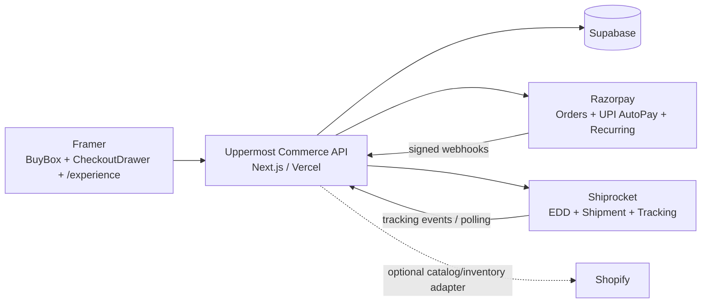
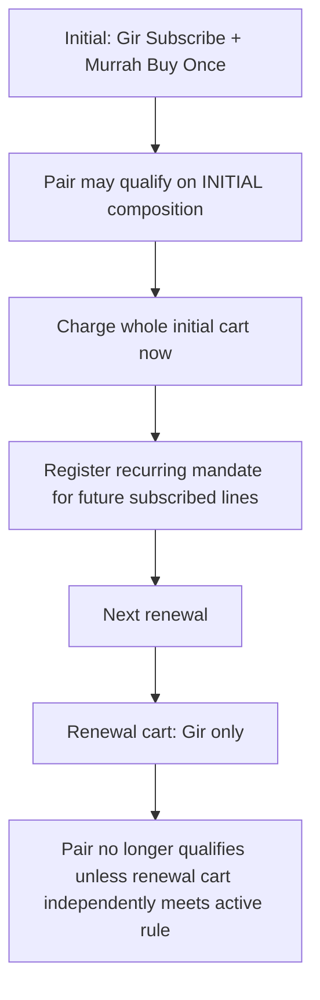
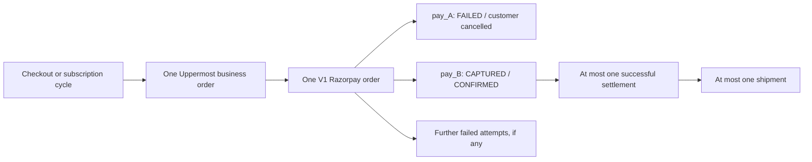
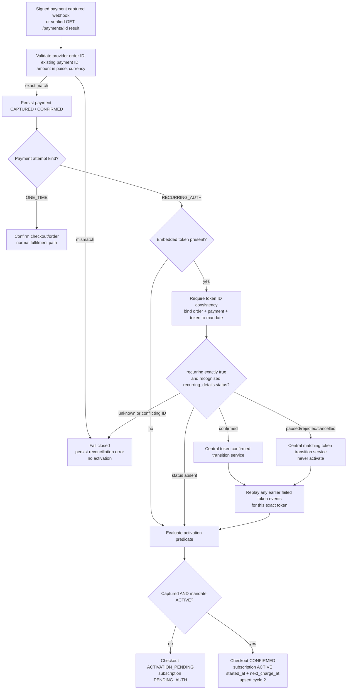
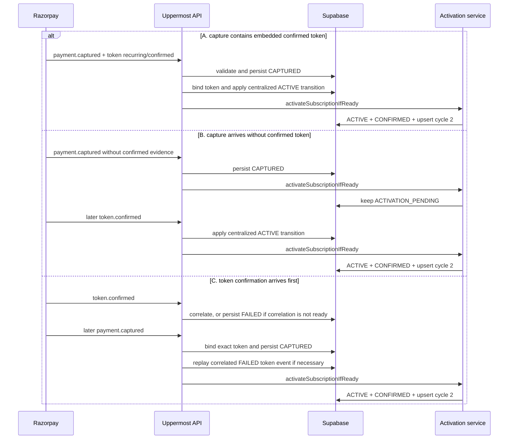
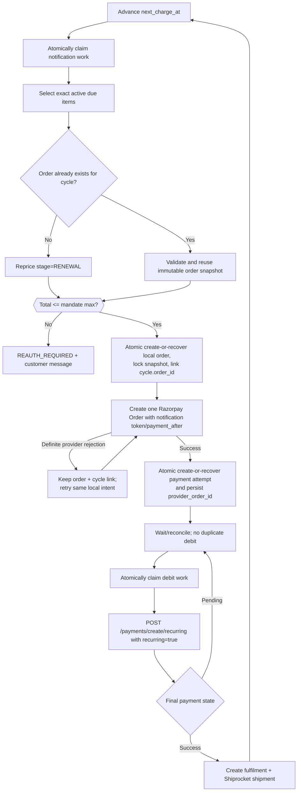

# Uppermost® Commerce V1 — Architecture & Implementation Blueprint

**Document status:** FROZEN PRODUCTION ARCHITECTURE
**Version:** 1.5
**Date:** 7 October 2026
**Audience:** CXO / Product / Engineering / Framer / Operations / Growth  
**Canonical repository path:** `docs/UPPERMOST_COMMERCE_ARCHITECTURE.md`

> This document is the durable source of truth for Uppermost commerce V1. Future implementation changes should update this file before changing the architecture.

## Executive Summary

Uppermost will keep the complete customer-facing buying experience inside Framer while using a thin secure commerce backend for all authoritative pricing, payment, subscription, shipping and state transitions.

- **Framer:** product experience, cart/checkout drawer, address, pincode/EDD, consent, Razorpay launch, inline payment state, and native `/experience` tracking page.
- **Next.js/Vercel:** public catalog projection, secure quote engine, promotion rules, checkout orchestration, Razorpay integration, renewals, Shiprocket proxy, messaging, idempotency and webhooks.
- **Supabase:** source of truth for commerce data, customers, addresses, orders, subscription items, mandates, messages, tracking and eventually Auth/RLS-backed customer account.
- **Razorpay:** money movement only — one-time orders, first recurring authorization payment, UPI AutoPay mandate/token, recurring debits, payment/webhook state.
- **Shiprocket:** serviceability, EDD, shipment creation, courier/AWB and tracking.
- **Shopify:** optional catalog/inventory reference during migration; Shopify Checkout is removed from the new purchase path.
- **fastrr:** excluded from V1 to avoid multiple pricing authorities and preserve the Framer-first experience.

### Core commercial model

1. Cart purchase mode is **per line item**, so a single order can contain Gir as subscription and Murrah as buy-once.
2. The initial payment charges the **whole initial cart immediately**.
3. Future renewal carts contain **subscription lines only**.
4. Subscription amount is **recalculated on every renewal** using current product price plus only promotions/entitlements that are eligible for that subscriber and lifecycle stage.
5. Razorpay mandate uses a **maximum authorised debit**, with configurable headroom. If a renewal exceeds the cap, no debit occurs; re-authorization is required.
6. New promotions do **not** automatically leak to existing subscribers unless explicitly configured.
7. Pair/bundle eligibility is re-evaluated against the cart being priced. A Gir subscription + Murrah buy-once can receive Pair benefit initially, but the renewal Gir-only cart does not.

## Executive Architecture


```mermaid
flowchart LR
  F[Framer
BuyBox + CheckoutDrawer + /experience] --> A[Uppermost Commerce API
Next.js / Vercel]
  A --> S[(Supabase)]
  A --> R[Razorpay
Orders + UPI AutoPay + Recurring]
  A --> SH[Shiprocket
EDD + Shipment + Tracking]
  A -. optional catalog/inventory adapter .-> SP[Shopify]
  R -->|signed webhooks| A
  SH -->|tracking events / polling| A
```

## Customer Experience

```mermaid
flowchart LR
  PDP[Product Page / BuyBox] --> ADD[Add to Order]
  ADD --> DRAWER[Same-page Checkout Drawer]
  DRAWER --> ADDR[Contact + Address once]
  ADDR --> EDD[Pincode + live EDD]
  EDD --> QUOTE[Server quote + offers + mandate cap]
  QUOTE --> RP[Razorpay Checkout
Desktop QR / Mobile Intent]
  RP --> VERIFY[Inline Confirming state]
  VERIFY --> EXP[/experience?t=secure-token]
  EXP --> TRACK[Live shipment timeline]
```

## Mixed Cart Example


```mermaid
flowchart TD
  I[Initial: Gir Subscribe + Murrah Buy Once] --> P[Pair may qualify on INITIAL composition]
  P --> PAY[Charge whole initial cart now]
  PAY --> M[Register recurring mandate for future subscribed lines]
  M --> R[Next renewal]
  R --> G[Renewal cart: Gir only]
  G --> NP[Pair no longer qualifies unless renewal cart independently meets active rule]
```

## Frozen Platform Responsibilities

| Platform | Responsibility | Must not own |
|---|---|---|
| Framer | All visible UI, cart drawer, address, pincode/EDD display, consent, payment launch, experience/tracking page | Payment secrets, authoritative price, mandate token |
| Next.js/Vercel | Pricing, promotions, quote security, checkout, renewals, integrations, normalized states | Long-term customer-facing layout |
| Supabase | Commerce state, customers, orders, subscriptions, mandates, messages, tracking, Auth/RLS | Client-trusted pricing |
| Razorpay | One-time payment, recurring authorization, UPI QR/Intent, token/mandate, later recurring debit | Subscription schedule, cart rules, offer logic |
| Shiprocket | Serviceability, EDD, shipment, courier/AWB, tracking | Checkout pricing |
| Shopify | Optional product/inventory sync reference | New checkout/payment authority |

## Current Live Offer Baseline

- Gir 1 L: standard ₹7,500; early-bird ₹7,000 through 4 Oct 2026.
- Murrah 1 L: standard ₹5,500; early-bird ₹5,000 through 4 Oct 2026.
- The Pair: qualifying Gir + Murrah combination receives configured Pair benefit; global promotion validity is one calendar year from configured start/end dates.
- Subscription benefit: ₹500 begins from shipment/cycle #2; never applies to the first subscription charge.
- Current shipping: free across India.
- All dates, values and eligibility are server configuration; none are hard-coded into Framer as payment authority.

## Promotion Engine

Promotions are modeled as **conditions → eligibility → actions**, not as one-off discount flags.

Supported conditions: date window, SKU/product/variant, required bundle composition, minimum cart value, minimum quantity, initial/renewal lifecycle, buy-once/subscription/mixed purchase shape, cycle number, new/existing subscriber, customer/subscription cohort, explicit entitlement, first/returning order, usage limit, stacking priority/group.

Supported actions: amount off, percent off, fixed bundle price, free shipping, shipping discount, free product, free gift wrap, Buy X Get Y, and informational/non-monetary benefit.

`promotion_entitlements` remains a separate table so multiple benefits can coexist, expire, be grandfathered, revoked, or have remaining-use counters.

## Cart & Subscription Model

```ts
type CartLine = {{
  lineId: string
  sku: string
  qty: number
  purchaseMode: "BUY_ONCE" | "SUBSCRIPTION"
  intervalDays?: 15 | 30 | 60
}}
```

V1 constraint: all subscription lines in one checkout use one common interval. The data model remains extensible to multiple recurring groups later.

### Initial vs renewal pricing

- **INITIAL:** price every line in the checkout, including one-time items.
- **RENEWAL:** build a new pricing cart from subscription items only.
- Pair/bundle promotions are re-evaluated each time against the current evaluated cart.
- Current public promotions are not automatically granted to older subscribers.
- Grandfathered or explicit subscriber rights are read from `promotion_entitlements`.

## Razorpay Variable Recurring Model

Uppermost does not use Razorpay Plans or Razorpay Subscriptions for V1. Uppermost owns the business subscription; Razorpay owns the financial mandate/payment rail.

```mermaid
flowchart LR
  U[Uppermost subscription] --> C[Razorpay Customer]
  C --> A[Initial recurring-authorisation Order]
  A --> T[UPI AutoPay token / mandate]
  T --> N[Uppermost scheduler]
  N --> Q[Recalculate renewal]
  Q --> O[New Razorpay Order]
  O --> D[/payments/create/recurring]
```

Initial cart is charged at authorization time. For mixed carts, the initial amount can include buy-once items, while future renewal projection includes only subscription items. Mandate maximum is server-calculated as the greater of the initial checkout total and the projected recurring total plus a configurable trust-preserving buffer.

If a future debit exceeds the mandate maximum: **do not debit; set REAUTH_REQUIRED; create a customer action message.**

## Payment UX & State Normalization

Raw Razorpay technical errors are stored internally. Framer receives normalized states and customer-ready messages only:

- `CHECKOUT_READY`
- `AUTHORIZING`
- `VERIFYING`
- `CONFIRMED`
- `ACTIVATION_PENDING`
- `PENDING`
- `FAILED_RETRYABLE`
- `INSUFFICIENT_FUNDS`
- `MANDATE_ACTION_REQUIRED`
- `MANDATE_PAUSED`
- `MANDATE_EXPIRED`
- `CAP_EXCEEDED`
- `CUSTOMER_CANCELLED`
- `QUOTE_CHANGED`
- `QUOTE_EXPIRED`
- `SYSTEM_ERROR`

The browser success callback is never sufficient for fulfillment. Signature verification and webhook/server reconciliation are authoritative.

## Checkout Drawer

There is no separate cart page in V1. The system has **cart state without a cart page**.

`BuyBox.tsx` edits the selected lines and opens `CheckoutDrawer.tsx`. The drawer provides selection/cart, complementary expression upsell, per-line Buy Once/Subscribe, contact, address, pincode/EDD, order summary, subscription consent and Razorpay launch.

Customer address is entered **once in Framer** and reused for Shiprocket and recurring fulfillment. Razorpay receives name/email/contact prefill where appropriate. Razorpay-managed QR/Intent is used; Uppermost does not generate its own payment QR.

## Native Framer /experience Page

After verification there is one navigation to `/experience?t=<high-entropy-token>`. This page replaces a generic thank-you page and becomes the customer's live order journey.

It displays:
- order confirmation and safe reference
- current shipment stage
- expected delivery window
- live tracking timeline
- latest scan/location when available
- items and paid pricing snapshot
- non-monetary benefits such as gift wrap
- subscription-only future selection, interval, next billing date, projected amount and mandate cap
- action-required messaging for mandate/renewal issues

The page itself is native Framer. A focused code component may render dynamic timeline data; the page is not a standalone React route.

## Secure Quote & Idempotency Model

A quote is valid only when both a high-entropy `quote_id` and `quote_token` match a server record. It is bound to guest/customer identity, cart fingerprint, line modes, interval, currency, pricing/promotion versions, shipping context, price snapshot, expiry and status.

Checkout preparation always re-prices server-side. Forged, expired, replayed or mismatched quotes are rejected. Price changes return `QUOTE_CHANGED` and a fresh quote; the system never silently charges a new amount.

All money-changing endpoints require an `Idempotency-Key`. Same key + same request returns the same result. Same key + changed request returns `409 IDEMPOTENCY_CONFLICT`.

## Public Catalog vs Transactional Quote Authority

`GET /api/commerce/catalog` is the public read-only authority for product-display state in Framer: products and variants, active/sellable state, standard price, a current display-price snapshot, release availability and explicitly public promotion copy/windows. It is a short-lived snapshot and never authorizes a charge or promises that an offer will apply to a particular cart.

`POST /api/commerce/quote` remains the final transactional authority for payable totals, promotion eligibility, Pair qualification, subscription benefits, entitlements and current inventory validation. Framer must refresh a quote before checkout and must render the returned quote when catalog display state and transactional state differ.

Release inventory is stored independently from physical/on-hand inventory. A release records capacity and committed quantity; the public remaining amount is `max(release_capacity - release_committed, 0)`, constrained by physical sellable inventory when that value is known. Raw warehouse metadata and private promotion conditions are never returned by the public catalog route.

## Core API Surface

| Endpoint | Purpose |
|---|---|
| `GET /api/commerce/catalog` | public product-display state, release availability and safe offer metadata |
| `POST /api/commerce/quote` | authoritative cart price, promotions, recurring projection |
| `POST /api/shipping/serviceability` | pincode eligibility, live EDD, shipping amount |
| `POST /api/checkout/prepare` | unified one-time / subscription / mixed checkout preparation |
| `POST /api/payments/verify` | server-side payment verification |
| `GET /api/checkout/status?session_id=` | pending / late payment reconciliation |
| `POST /api/webhooks/razorpay` | signed payment/mandate callbacks |
| `POST /api/webhooks/carrier-events` | Shiprocket shipment/tracking updates; provider-safe public alias authenticated with `x-api-key` |
| `GET /api/experience?token=` | safe customer-facing order/tracking/subscription data |
| `GET/POST /api/customer/addresses` | saved Uppermost addresses |
| `GET /api/internal/cron/renewals` | bearer-protected renewal wake-up (daily on current Hobby plan) |
| `POST /api/internal/renewals/run` | backward-compatible protected renewal-runner alias |

## Shiprocket Webhook Endpoint

Shiprocket must be configured with the provider-safe webhook URL
`https://uppermost-dashboard-latest-orcin.vercel.app/api/webhooks/carrier-events`
and auth-token type `x-api-key`. The token value is the server-only
`SHIPROCKET_WEBHOOK_SECRET`; it must never be placed in the URL, Framer code,
documentation, or logs. The implementation retains
`POST /api/webhooks/shiprocket` only as a backward-compatible internal alias;
it is not the URL configured in Shiprocket because provider validation blocks
URLs containing the provider name.

## Unified Checkout Prepare

`POST /api/checkout/prepare` handles all shapes:

- zero subscription lines → normal Razorpay Order
- one or more subscription lines → recurring authorization Order + initial whole-cart payment

It validates secure quote, re-prices, resolves/creates customer, snapshots address and items, creates an internal Uppermost order in `PAYMENT_PENDING`, then creates the relevant Razorpay order. The response contains only public checkout data.

## Razorpay Live Production Architecture

Uppermost does not use Razorpay Plans or Razorpay Subscriptions. Razorpay is the payment and mandate rail; the Uppermost database remains authoritative for subscription items, 15/30/60-day schedules, cycle pricing, retries, customer state, orders and fulfilment.

### Exact supported webhook events

The route explicitly dispatches only:

- `payment.authorized`
- `payment.captured`
- `payment.failed`
- `token.confirmed`
- `token.rejected`
- `token.cancelled`
- `token.paused`

`order.paid` and any other correctly signed event are acknowledged as persisted no-ops. `payment.captured` is the capture authority. Razorpay `subscription.*` events are intentionally unsupported and must not be enabled.

The webhook reads `request.text()` exactly once and verifies `X-Razorpay-Signature` using HMAC-SHA256 and `RAZORPAY_WEBHOOK_SECRET` with timing-safe comparison before parsing JSON. `x-razorpay-event-id` is the durable identity; a raw-body SHA-256 hash is used only when that header is absent.

### Durable webhook claiming and retries

`claim_payment_webhook_event` atomically inserts or locks `(provider, provider_event_id)` and returns `CLAIMED`, `PROCESSED`, or `IN_PROGRESS`. States are `RECEIVED → PROCESSING → PROCESSED`; processing errors become `FAILED`. A provider redelivery can reclaim `FAILED` or stale `PROCESSING` work, while `PROCESSED` is an idempotent 200 and a live concurrent worker receives 202. This state lives in Postgres, not function memory.

### Payment validation and monotonicity

Before any reconciliation mutation, the service verifies the stored provider order ID, any already-bound provider payment ID, exact amount in paise, currency, and the checkout/order or subscription-cycle context. A mismatch is stored on the payment attempt and cannot confirm an order. `CAPTURED`/`CONFIRMED` are terminal against delayed authorized/failed events for the **same payment ID**.

**Approved payment-attempt cardinality (5 October 2026):** one Uppermost business order has one current V1 Razorpay provider order, but that provider order is a payment container and may contain multiple distinct Razorpay `pay_*` entities. Each bound `pay_*` ID has exactly one immutable local `payment_attempt`; failed/cancelled attempts remain historical rows when a customer retries on the same provider order. A renewal cycle still has exactly one renewal business order and one locked pricing snapshot, but can have multiple historical payment attempts. At most one attempt per business order/cycle may reach `CAPTURED`/`CONFIRMED`, and fulfilment remains at most once. Provider payment IDs remain unique; provider order IDs and subscription cycle IDs are **not** unique on `payment_attempts`. Before the first `pay_*` ID, the prepared unbound attempt may be bound once; it is never rebound to a different ID. Payment-first correlation, strict context checks, an atomic create-or-recover path, and a database successful-settlement guard protect retries and concurrent callbacks. This corrects the previous one-provider-order/one-payment-attempt assumption without changing checkout preparation, renewal price locks, or provider-order creation.


```mermaid
flowchart LR
  C[Checkout or subscription cycle] --> O[One Uppermost business order]
  O --> R[One V1 Razorpay order]
  R --> A[pay_A: FAILED / customer cancelled]
  R --> B[pay_B: CAPTURED / CONFIRMED]
  R --> N[Further failed attempts, if any]
  B --> S[At most one successful settlement]
  S --> F[At most one shipment]
```

Payment events and browser verification both use `resolve_razorpay_payment_attempt`. Under a transaction-scoped provider-order lock it first finds the immutable `pay_*` row, validates the provider order, paise, currency, business order and checkout/cycle, then returns it. A first payment may bind the single unbound row; a new payment ID after terminal failed rows creates a sibling. A still-active predecessor, already-confirmed order, cross-context binding, or amount/currency disagreement fails closed. The DB retains unique non-null payment IDs and a partial unique successful-settlement index by business order. The incident `pay_Tk3E2IiIdjjokP` (failed) followed by `pay_Tk3EiYNHka2D7P` (captured) under `order_Tk3Dr8MGXvR9ya` is the motivating case; existing rows are not automatically replayed or modified by this change.

### Mandate/token correlation and state machine

Recurring status is read from `payload.token.entity.recurring_details.status`; only the explicit allowlisted event name is used as a fallback for Razorpay token-confirmed payload variants that omit this field. Unknown or contradictory states fail processing and never become active.

Correlation order is:

1. existing `provider_token_id`;
2. an already-bound mandate `provider_order_id`;
3. token `payment_id` → payment attempt → Uppermost order → subscription → mandate;
4. token `order_id` through the same chain, with deterministic first-attempt lookup when necessary. Never infer from provider customer ID alone.

The initial checkout persists Razorpay customer ID and order ID on the mandate. A captured payment binds payment ID and token ID. When the strictly validated `RECURRING_AUTH` capture contains an embedded token with an ID, `recurring = true`, and `recurring_details.status = confirmed`, that signed webhook or verified provider-fetch payload is also authoritative mandate-confirmation evidence. It is passed through the same centralized mandate transition service as a standalone `token.confirmed` event. Token ID presence without the explicit confirmed recurring status never activates a mandate. The handler never guesses from customer ID alone. If a token webhook arrives before it can be correlated, it remains `FAILED`; once the payment binds the token, stored failed events for that token are atomically reclaimed and replayed.

Mandate transitions are centralized:

| Current | confirmed/ACTIVE | paused | rejected | cancelled |
|---|---|---|---|---|
| PENDING | ACTIVE | PAUSED | REJECTED | CANCELLED |
| ACTIVE | ACTIVE | PAUSED | ACTIVE | CANCELLED |
| PAUSED | PAUSED | PAUSED | PAUSED | CANCELLED |
| REJECTED | REJECTED | REJECTED | REJECTED | CANCELLED |
| REAUTH_REQUIRED | REAUTH_REQUIRED | REAUTH_REQUIRED | REAUTH_REQUIRED | CANCELLED |
| EXPIRED | EXPIRED | EXPIRED | EXPIRED | EXPIRED |
| CANCELLED | CANCELLED | CANCELLED | CANCELLED | CANCELLED |

An older event timestamp is ignored. `CANCELLED` and `EXPIRED` are terminal; `PAUSED` cannot be reactivated by a `token.confirmed` webhook.

This is deliberate and follows Razorpay's Recurring Payments token contract:

- [`token.rejected`](https://razorpay.com/docs/api/payments/recurring-payments/webhooks/#token-rejected) is emitted only when token creation/mandate registration fails before completion. It is not a valid later lifecycle transition for an already confirmed token. Therefore `ACTIVE + token.rejected` remains `ACTIVE`; stale events are additionally rejected by provider-event timestamp ordering.
- [`token.confirmed`](https://razorpay.com/docs/api/payments/recurring-payments/webhooks/#token-confirmed) means the bank completed mandate registration. Razorpay does not document it as a UPI pause-resume event, so it cannot by itself prove that a currently paused mandate was resumed.
- Razorpay's [UPI token-management API](https://razorpay.com/docs/api/payments/recurring-payments/upi/tokens/) documents fetch and cancel operations, but no merchant-side resume-token endpoint and no distinct resume webhook. Resumption must therefore occur through a Razorpay/provider-supported customer mandate-management channel, outside Uppermost's webhook handler.
- Before Uppermost may move a locally `PAUSED` mandate back to `ACTIVE`, a server-only reconciliation flow must fetch the customer's current tokens from `GET /v1/customers/:customer_id/tokens`, match the exact stored `provider_token_id`, and verify `recurring = true` plus `recurring_details.status = confirmed`. That future reconciliation must use its own audited, atomic transition path; webhook `token.confirmed` processing remains monotonic and cannot perform the resume.

### Initial recurring activation ordering

Payment capture and mandate confirmation are independent prerequisites. Confirmation may arrive as either (a) a standalone `token.confirmed` event or (b) the embedded confirmed recurring-token entity in a strictly validated `payment.captured` payload/provider fetch. Capture without either form of confirmation leaves checkout/subscription `ACTIVATION_PENDING`; token confirmation alone does not activate without a captured recurring-auth payment. Every arrival order calls the same mandate transition and subscription activation services; only when both prerequisites are persisted are the subscription and checkout set `ACTIVE`/`CONFIRMED` and cycle 2 created. Token ID presence alone is not proof of an active mandate. Duplicate capture/token events converge through monotonic transitions and the unique `(subscription_id, cycle_number)` cycle constraint.

#### Authoritative activation predicate

```text
initial subscription activation =
  strictly validated RECURRING_AUTH payment is CAPTURED
  AND the exactly correlated recurring mandate is ACTIVE
  AND that mandate has a bound provider_token_id
```

There is no alternative activation shortcut. In particular, an order being `CONFIRMED`, a browser success callback, a populated `token_id`, or `payment.status = captured` on its own is insufficient. `activateSubscriptionIfReady` evaluates the persisted prerequisites and is safe to call after either prerequisite changes.

| Persisted payment | Persisted mandate | Checkout | Subscription | Side effects |
|---|---|---|---|---|
| not captured | not `ACTIVE` | `ACTIVATION_PENDING` | `PENDING_AUTH` | no future cycle |
| captured | not `ACTIVE` | `ACTIVATION_PENDING` | `PENDING_AUTH` | no future cycle |
| not captured | `ACTIVE` | `ACTIVATION_PENDING` | `PENDING_AUTH` | no future cycle |
| captured | `ACTIVE` with bound token | `CONFIRMED` | `ACTIVE` | set `started_at` once, derive `next_charge_at`, upsert exactly one cycle 2 |

#### Recurring authorization reconciliation flow


```mermaid
flowchart TD
  E[Signed payment.captured webhook<br/>or verified GET /payments/:id result] --> V[Validate provider order ID,<br/>existing payment ID, amount in paise, currency]
  V -->|mismatch| X[Fail closed<br/>persist reconciliation error<br/>no activation]
  V -->|exact match| C[Persist payment CAPTURED / CONFIRMED]
  C --> K{Payment attempt kind?}
  K -->|ONE_TIME| O[Confirm checkout/order<br/>normal fulfilment path]
  K -->|RECURRING_AUTH| T{Embedded token present?}
  T -->|no| P[Evaluate activation predicate]
  T -->|yes| I[Require token ID consistency<br/>bind order + payment + token to mandate]
  I --> S{recurring exactly true<br/>and recognized recurring_details.status?}
  S -->|confirmed| CT[Central token.confirmed transition service]
  S -->|paused/rejected/cancelled| NT[Central matching token transition service<br/>never activate]
  S -->|status absent| P
  S -->|unknown or conflicting ID| X
  CT --> R[Replay any earlier failed token events<br/>for this exact token]
  NT --> R
  R --> P
  P --> A{Captured AND mandate ACTIVE?}
  A -->|no| AP[Checkout ACTIVATION_PENDING<br/>subscription PENDING_AUTH]
  A -->|yes| AC[Checkout CONFIRMED<br/>subscription ACTIVE<br/>started_at + next_charge_at<br/>upsert cycle 2]
```

The same reconciliation path is entered from `POST /api/webhooks/razorpay` and `POST /api/payments/verify`. The webhook provides signed provider data; browser verification first validates the checkout signature and then fetches the payment directly from Razorpay. Neither path trusts browser-supplied payment fields beyond identifiers used for correlation.

#### Embedded token evidence rules

These rules apply only after strict payment identity validation succeeds for the stored `RECURRING_AUTH` attempt.

| Embedded payment token evidence | Result |
|---|---|
| no embedded token and no `token_id` | payment is captured; mandate is unchanged; activation remains pending unless already active |
| `token_id` only | bind when correlation is conflict-free; **do not activate** |
| embedded `id`, `recurring = true`, status absent | bind when conflict-free; **do not activate** |
| embedded `id`, `recurring = true`, status `confirmed` | bind exact token; invoke centralized `token.confirmed`; evaluate activation |
| embedded `id`, `recurring = true`, status `paused`, `rejected`, or `cancelled` | invoke the corresponding centralized transition; do not activate |
| embedded token with `recurring !== true` | not recurring-confirmation evidence; do not activate |
| top-level `token_id` differs from embedded `token.id` | fail closed with `PAYMENT_EMBEDDED_TOKEN_ID_CONFLICT` |
| token/order/payment differs from an existing mandate binding | fail closed with the relevant mandate-provider conflict; record reconciliation error |
| unknown non-empty recurring status | fail closed; never coerce to active |

Only `confirmed` is positive activation evidence. Recognized negative states use the same state machine as standalone token webhooks. An absent state is incomplete evidence, while an unknown state is contradictory/unsupported evidence and fails processing for investigation.

#### Arrival-order convergence


```mermaid
sequenceDiagram
  participant RP as Razorpay
  participant API as Uppermost API
  participant DB as Supabase
  participant ACT as Activation service

  alt A. capture contains embedded confirmed token
    RP->>API: payment.captured + token recurring/confirmed
    API->>DB: validate and persist CAPTURED
    API->>DB: bind token and apply centralized ACTIVE transition
    API->>ACT: activateSubscriptionIfReady
    ACT->>DB: ACTIVE + CONFIRMED + upsert cycle 2
  else B. capture arrives without confirmed token
    RP->>API: payment.captured without confirmed evidence
    API->>DB: persist CAPTURED
    API->>ACT: activateSubscriptionIfReady
    ACT->>DB: keep ACTIVATION_PENDING
    RP->>API: later token.confirmed
    API->>DB: apply centralized ACTIVE transition
    API->>ACT: activateSubscriptionIfReady
    ACT->>DB: ACTIVE + CONFIRMED + upsert cycle 2
  else C. token confirmation arrives first
    RP->>API: token.confirmed
    API->>DB: correlate, or persist FAILED if correlation is not ready
    RP->>API: later payment.captured
    API->>DB: bind exact token and persist CAPTURED
    API->>DB: replay correlated FAILED token event if necessary
    API->>ACT: activateSubscriptionIfReady
    ACT->>DB: ACTIVE + CONFIRMED + upsert cycle 2
  end
```

All three paths converge to the same database state. A standalone `token.confirmed` remains supported even when the embedded-token path already activated the mandate. Provider delivery order is not a business-state ordering guarantee.

#### Idempotency, replay, and concurrency guarantees

- Webhook identity is unique on `(provider, provider_event_id)` and claimed atomically. A processed duplicate is acknowledged without processing; concurrent work receives `IN_PROGRESS`; failed or stale work can be reclaimed.
- Payment state is monotonic. A later `payment.authorized` or `payment.failed` cannot downgrade `CAPTURED`/`CONFIRMED`; a repeated capture may still run reconciliation so an older `ACTIVATION_PENDING` checkout can heal after this code is deployed.
- Mandate events carry provider occurrence time. Older events are ignored by the database transition function; terminal and monotonic transition rules still apply to newer events.
- Binding is compare-and-set and conflict-checked across provider token, order and payment IDs. Concurrent or cross-checkout token reuse fails closed.
- Activation preserves an existing `started_at`; therefore replay cannot reset the subscription epoch or move `next_charge_at` forward a second time.
- Cycle creation is an idempotent upsert protected by unique `(subscription_id, cycle_number)`. Duplicate capture/token deliveries cannot create a second cycle 2.
- Existing uniqueness constraints protect provider payment IDs, one successful settlement per business order/cycle, one renewal business order per cycle, customer messages and shipments. Multiple *unsuccessful* payment attempts may share a provider order or cycle; activation never directly creates a second settlement or shipment.
- A token-first event that cannot yet correlate is intentionally marked `FAILED`, not discarded. Binding the token during capture reclaims and replays matching failed token events in creation order.
- A processing error remains observable in `payment_events.processing_error` or `payment_attempts.raw_error`; it must not be repaired with an unaudited manual state update.

#### Recovery and operational boundaries

- A recurring checkout in `ACTIVATION_PENDING` is not a failed payment and must not launch a second checkout. Framer polls checkout status.
- After deploying reconciliation improvements, redelivery of the original signed `payment.captured` event or a normal verified payment fetch can heal a captured checkout when the provider payload contains confirmed embedded-token evidence.
- There is deliberately no public/manual force-activate route. Operators must prove capture and exact token confirmation through signed webhook data or a verified provider fetch.
- Shipment creation is gated by capture, but subscription activation additionally requires the active mandate. The immutable paid order may be confirmed while the recurring checkout remains `ACTIVATION_PENDING`.
- The database hardening migration `20261005090000_harden_razorpay_recurring_architecture.sql` supplies durable claims, provider bindings, transition ordering and uniqueness constraints. **Environment note (5 October 2026): the operator confirms this migration is already applied. The embedded-token reconciliation fix is code-only and requires no additional migration.** Verify migration history rather than rerunning it solely for this fix.

#### Implemented now vs future scope

| Area | Implemented production behavior | Explicit future scope |
|---|---|---|
| initial activation | embedded confirmed token and standalone `token.confirmed`, in either order | none required for the tested Razorpay flow |
| activation recovery | webhook redelivery, verified provider fetch, failed token-event replay | operator reconciliation UI/route only if it preserves the same evidence and audit guarantees |
| paused mandate resume | `token.confirmed` webhook cannot reactivate `PAUSED` | server-only exact-token fetch and audited resume transition after Razorpay confirms the supported customer/provider flow |
| unknown provider states | fail closed and retain diagnostic state | add an allowlisted transition only after provider lifecycle evidence and tests |
| multiple schedules | one interval per V1 subscription | schedule identity and per-schedule cycle uniqueness migration described below |

#### Implementation and test traceability

| Concern | Authoritative implementation | Regression evidence |
|---|---|---|
| raw webhook verification, allowlisted dispatch, durable claim | `app/api/webhooks/razorpay/route.ts`, `lib/commerce/webhooks.ts` | `tests/commerce/razorpay-hardening.test.ts` |
| strict payment identity and payment monotonicity | `lib/commerce/payments/transitions.ts`, `lib/commerce/payments/service.ts` | `tests/commerce/razorpay-hardening.test.ts` |
| embedded token evidence, binding, centralized mandate transition, replay | `lib/commerce/payments/service.ts`, `lib/commerce/payments/mandates.ts` | `tests/commerce/razorpay-embedded-activation.test.ts`, `tests/commerce/razorpay-hardening.test.ts` |
| two-prerequisite activation and one cycle 2 | `lib/commerce/subscriptions/activation.ts` | `tests/commerce/razorpay-embedded-activation.test.ts` |
| browser-return provider fetch | `app/api/payments/verify/route.ts`, `lib/commerce/razorpay/client.ts` | typecheck/build plus embedded reconciliation service tests |
| durable webhook/mandate/cycle database guards | `supabase/migrations/20261005090000_harden_razorpay_recurring_architecture.sql` | migration review plus production SQL audit |
| renewal claim, cap, timing, retry policy | `lib/commerce/renewals.ts`, `lib/commerce/subscriptions/schedule.ts`, cron routes | `tests/commerce/renewal-hardening.test.ts` |
| renewal order recovery/linking and payment-attempt idempotency | `lib/commerce/renewal-order.ts`, `supabase/migrations/20261005113000_recover_renewal_orders_by_cycle.sql` | `tests/commerce/renewal-order-recovery.test.ts` |

Automated tests prove local routing, validation, state convergence and duplicate resistance using controlled provider/database seams. They do not prove Razorpay delivery, Vercel environment configuration, Supabase production migration state, or Shiprocket behavior. Those remain mandatory Test/Live-mode runbook checks. A future AI or engineer must not convert a passing mocked test into a claim that a provider callback was delivered in production.

## Renewal Sequence


```mermaid
flowchart TD
  N[Notification due] --> NL[Atomically claim notification work]
  NL --> C[Select exact active due items]
  C --> E{Order already exists for cycle?}
  E -->|No| P[Reprice stage=RENEWAL]
  E -->|Yes| V[Validate and reuse immutable order snapshot]
  P --> M{{Total <= mandate max?}}
  V --> M
  M -->|No| R[REAUTH_REQUIRED + customer message]
  M -->|Yes| O[Atomic create-or-recover local order,<br/>lock snapshot, link cycle.order_id]
  O --> RO[Create one Razorpay Order with notification token/payment_after]
  RO -->|Definite provider rejection| RR[Keep order + cycle link;<br/>retry same local intent]
  RR --> RO
  RO -->|Success| PA[Atomic create-or-recover payment attempt<br/>and persist provider_order_id]
  PA --> W[NOTIFIED until scheduled_charge_at]
  W --> DL[Atomically claim debit work]
  DL --> B[POST /payments/create/recurring with recurring=true]
  B --> F{Final payment state}
  F -->|Success| S[Create fulfilment + Shiprocket shipment]
  F -->|Pending| W[Wait/reconcile; no duplicate debit]
  S --> N[Advance next_charge_at]
```

### Subscription-cycle state machine

`DUE → NOTIFICATION_PROCESSING → NOTIFIED → PROCESSING → PAYMENT_PENDING/PAID`. Unsafe or incomplete provider results become `RECONCILIATION_PENDING`; bounded, provably unsuccessful retries use `FAILED`; over-cap or unusable mandate becomes `REAUTH_REQUIRED`; inactive subscriptions become `CANCELLED`. Postgres claim functions use `FOR UPDATE SKIP LOCKED`.

The price lock occurs during the first notification processing attempt, before the Razorpay Order is created. The cycle stores the exact due-item snapshot, full authoritative pricing snapshot, amount, and `price_locked_at`. A retry first discovers an order through the unique `orders.subscription_cycle_id`; when present, it validates customer, subscription, cycle, `RENEWAL` kind, currency, all monetary fields, address and the complete pricing snapshot, then reuses that snapshot rather than repricing. The debit uses that locked amount; it is never silently repriced between customer notification and charge.

Local order establishment is a short Postgres transaction protected by a row lock on the cycle and the unique order-per-cycle index. It creates the order plus item/adjustment/benefit snapshots only when no cycle order exists, or recovers the exact existing order after a conflict, and writes `subscription_cycles.order_id` before any Razorpay HTTP request. This specifically repairs the crash/failure window where a valid order exists but the older code left `cycle.order_id` null. A materially conflicting existing row fails closed; it is never overwritten or deleted.

V1 supplies all active subscription items to the explicit cycle-pricing interface because one subscription has one schedule. Buy-once items never enter it. Current catalog price, active promotions, entitlements, grandfathering, pair/bundle composition, inventory and renewal cycle number are re-evaluated at lock time. The subscription benefit is eligible only from cycle 2 under promotion configuration.

Razorpay Order creation passes a deterministic `rnl-<32 hex cycle UUID>` receipt and `notification: { token_id, payment_after }`. A definite provider-order failure retains the local order and cycle link, so a later claimed retry uses that same local intent. Provider success is persisted through a second short transaction that creates or recovers the initial unbound cycle payment attempt, validates its order/provider-order/amount/currency/kind, and links the provider order to the cycle. A later distinct Razorpay payment ID may create a sibling attempt after a terminal unsuccessful attempt, but not a second successful settlement. The debit later calls `POST /payments/create/recurring` with customer, token, order, amount, currency and `recurring: true`. Token values are server-only and never logged. One cycle has a unique local order and locked amount, one current provider order, at most one captured settlement and at most one shipment.

Provider timeout, reset, malformed response, or 5xx is ambiguous and becomes `RECONCILIATION_PENDING`; it is never blindly charged again. A bounded retry (maximum three attempts, 24h then 48h delay) is allowed only after a definite provider 4xx/failure. Before a retry, the service fetches `/orders/{id}/payments`; a captured payment is reconciled instead of retried. Insufficient funds and temporary failures may enter the bounded policy; mandate paused/rejected/cancelled/expired and cap failures require customer action.

`subscriptions.next_charge_at` advances only after a verified captured cycle payment. The next due timestamp is the paid cycle's scheduled `due_at + interval_days` in UTC—not cron execution time—so failure/retry does not skip a cycle. The created next cycle receives its own notification and debit timestamps.

Fulfilment occurs only after capture. Shiprocket reads the paid order's exact immutable pricing/item snapshot. `AUTHORIZED`, `PENDING`, `ACTIVATION_PENDING`, `FAILED`, `REAUTH_REQUIRED`, and ambiguous states cannot create a shipment.

## Cron Architecture

The currently connected Vercel Hobby project runs `GET /api/internal/cron/renewals` once daily at `0 0 * * *` (UTC), which is the highest frequency that plan permits. Cycles use a 50-hour notification lead so a daily invocation plus Hobby scheduling jitter still creates the Razorpay notification at least 24 hours before `payment_after`. The exact business due date remains stored in UTC; the debit can occur on the first daily invocation after it. Moving to Vercel Pro is recommended before meaningful subscription volume: then change the cron to hourly (`0 * * * *`) and the scheduler lead to 25 hours for tighter execution.

Cron is only a wake-up signal; all claims and transitions are durable in Postgres. The route requires `Authorization: Bearer <COMMERCE_CRON_SECRET>`. Because Vercel injects the value of its specially named `CRON_SECRET`, Production must configure `CRON_SECRET` to the same secret value as `COMMERCE_CRON_SECRET`. Neither is exposed to Framer. The legacy protected `POST /api/internal/renewals/run` remains an alias.

Each invocation claims finite batches for notification and debit independently, processes them, persists every transition, and exits. Concurrent invocations are safe through `SKIP LOCKED`, the cycle row lock, unique `orders(subscription_cycle_id)` and `payment_attempts(subscription_cycle_id)` indexes, and create-or-recover transactions. Provider calls are never made inside a database transaction. Only the worker that atomically claimed a notification cycle reaches the provider boundary, preventing concurrent workers from blindly creating two provider orders.

## Product-Agnostic Subscription Architecture

Payment and scheduling code has no Gir, Murrah, Ghee, or category dependency. It traverses subscription → explicit due items → catalog/pricing engine → cycle snapshot → payment attempt → order/fulfilment. Multiple SKUs, quantities greater than one, new categories, price changes and inactive products flow through the same boundaries. Product-specific rules live only in catalog, promotion, subscription eligibility and fulfilment metadata.

## Future Multi-Schedule Subscriptions

**CURRENT V1:** one customer subscription has one common `interval_days` of exactly 15, 30, or 60 UTC days; all active subscription items are selected by the scheduler for that schedule.

**FUTURE:** one customer subscription may contain schedules/groups, for example Gir every 30 days, Mustard Oil every 15 days, and Honey every 60 days. A future `subscription_schedules` layer can choose the exact item subset and create a cycle for that due group. The payment architecture remains cycle-based and schedule-agnostic: pricing accepts explicit cycle items, mandate cap applies to that cycle amount, webhooks reconcile by payment attempt/cycle, and fulfilment reads exact paid cycle/order items. Razorpay integration does not need replacement. The remaining V1 schema coupling is that `subscription_cycles` currently keys cycle number by subscription and `subscriptions` owns `interval_days`; a future migration must add schedule identity to the cycle uniqueness key.

## Production Environment and Deployment Sequence

Server-only Vercel Production variables: `SUPABASE_SERVICE_ROLE_KEY`, `COMMERCE_TOKEN_PEPPER`, `COMMERCE_CRON_SECRET`, `CRON_SECRET` (same value for Vercel scheduling), `RAZORPAY_KEY_SECRET`, `RAZORPAY_WEBHOOK_SECRET`, Shiprocket credentials/webhook secret, and optional Shopify Admin credentials when that adapter is used. Public/config variables: `NEXT_PUBLIC_SUPABASE_URL`, `NEXT_PUBLIC_SUPABASE_ANON_KEY`, `RAZORPAY_KEY_ID`, `RAZORPAY_API_BASE_URL=https://api.razorpay.com/v1`, commerce origin/inventory settings, pickup postcode/location and mandate/quote settings. Recurring tokens never enter environment variables or the browser.

General first-time deployment order: apply unapplied database migrations; configure Production variables; deploy Next.js; configure Razorpay Live webhook URL/events/secret; verify invalid and signed webhook requests; invoke unauthorized/authorized cron checks; run one low-value one-time test; run all three recurring authorization orders (embedded confirmation, capture then token, token then capture); validate a notification-stage renewal, debit-stage capture, single order/message/shipment, and experience page.

For the 5 October 2026 embedded-token reconciliation deployment, the operator confirms the hardening migration is already applied. Verify migration history and deploy the code; no new migration accompanies that fix.

## Customer Messaging

### Approved downstream communication extension (7 October 2026)

Operator-only Communications and Offers screens are hosted in this repository;
Framer continues to own customer-facing commerce UI. Supabase Auth verifies
operators and server-owned ADMIN/VIEWER membership authorizes administration.
Guest checkout and financial/provider state machines retain their contracts.

The existing `integration_outbox` carries durable communication events and work.
QStash is asynchronous HTTP transport to Vercel, never the sole intent record.
Exception-isolated narrow event capture and bounded recovery must not roll back
valid financial transitions. External communication providers are never awaited
by checkout, payment, mandate or shipment communication hooks.

Rules read incremental `communication_customer_features` and visitor behavior
projections, not repeated historical order/payment/analytics joins. Events inspect
one subject; scheduled audiences use bounded indexed keyset pages and immutable
run snapshots. Existing `customer_messages`/`message_deliveries` remain canonical
message/delivery records, extended with immutable content versions and provider
approval artifacts. Communications cannot mutate pricing or business state.

Optional checkout visitor/session headers are analytics context only: they do
not enter the checkout body schema, request hash, quote fingerprint or provider
payment payload. Shared-browser links preserve historical validity periods;
checkout declarations are identified, not cryptographically verified.

The approved tracker migration moves only first-party Supabase ingestion to a
bounded server API. GA4 and Clarity remain independent destinations using the
same tracker-owned browser identity. Anonymous analytics permissions are revoked
only after the ingestion API and external GTM update are live and validated.
See `UPPERMOST_COMMUNICATION_SPEC.md` and the implementation plan for scope.

Three dedicated layers:

- `message_templates`: centrally managed message key/channel/version/copy
- `customer_messages`: durable in-app/customer action records linked to order/subscription/payment/shipment
- `message_deliveries`: email/SMS/in-app delivery attempts and provider status

A code fallback catalog (`lib/commerce/messages.ts`) guarantees safe copy if a DB template is unavailable. DB copy can be changed without redeploying Framer.

## Data Domains

Core tables/adaptations:

`products`, `product_variants`, `product_variant_releases`, `promotions`, `promotion_entitlements`, `carts`, `cart_items`, `commerce_quotes`, `customers`, `customer_addresses`, `checkout_sessions`, `orders`, `order_items`, `order_adjustments`, `order_benefits`, `subscriptions`, `subscription_items`, `subscription_cycles`, `recurring_mandates`, `payment_attempts`, `payment_events`, `shipments`, `tracking_events`, `message_templates`, `customer_messages`, `message_deliveries`, `idempotency_records`.

Money should be stored as integer paise wherever practical.

## Security Principles

- Never trust frontend price, discount, shipping, weight, dimensions or quote id alone.
- Never expose Razorpay key secret, webhook secret, recurring token, Shiprocket credentials or Supabase service role.
- Restrict production CORS to Uppermost domains and explicitly configured preview origins.
- Verify Razorpay signatures/webhooks and process idempotently.
- Use high-entropy public experience tokens; never authorize tracking from sequential order number alone.
- Snapshot checkout address and commercial terms for audit/reconciliation.
- Apply RLS to exposed Supabase tables and keep sensitive payment/mandate records server-only.

## Authentication Roadmap

Checkout remains guest-friendly. Account/login should not block purchase. Supabase Auth is the preferred identity layer for later customer account features, supporting Google, email OTP/magic-link and phone OTP. Phone OTP in India should be enabled only after compliant SMS/DLT setup is ready.

## Existing BuyBox Migration Notes

The current BuyBox already has the visual 15/30/60 interval control, but purchase frequency is global rather than per line; Pair and subscription calculations are performed client-side; one-time checkout currently creates a Shopify Storefront cart and redirects to Shopify; subscription is still represented as a reserve/waitlist flow. The new architecture preserves the visual design while moving commerce authority to the backend and opening a same-page Checkout Drawer.

## Rollout Order

1. Database migrations + authoritative catalog/promotion seed.
2. Pricing engine + quote security/idempotency.
3. Shiprocket serviceability/EDD.
4. Unified checkout prepare + normal Razorpay one-time path.
5. Recurring authorization path and mandate persistence.
6. Payment verification + webhooks + normalized messaging.
7. Framer cart state + Checkout Drawer + BuyBox refactor.
8. Native Framer `/experience` page + live tracking API.
9. Renewal scheduler + pre-debit lifecycle + recurring debit.
10. Test-mode matrix and production cutover.

## Must-Pass Test Matrix

- Gir buy-once.
- Gir subscription.
- Gir subscription + Murrah buy-once.
- Gir + Murrah both subscribed.
- Initial mixed cart Pair qualification.
- Renewal Gir-only no Pair qualification.
- Pair promotion expiry after configured one-year window.
- Early-bird expiry.
- Subscription benefit absent on cycle 1 and present on cycle 2.
- New-subscriber promo does not leak to existing subscriber.
- Minimum-cart promotion.
- Free gift wrap benefit.
- forged/wrong/expired/replayed quote.
- duplicate prepare and idempotency conflict.
- duplicate webhook.
- amount above mandate cap → no debit / re-auth.
- payment pending/late success → no double payment.
- Shiprocket unavailable → payment/order state remains safe.
- Experience token cannot expose another customer’s order.

## External Platform Constraints — Validate in Test Mode

1. Razorpay UPI AutoPay authorization requires Customer + Order + authorization transaction; recurring tokens are linked to the customer.
2. UPI Collect for new AutoPay registrations is deprecated for most new registrations from 28 Feb 2026; Intent/QR is the expected registration path.
3. Razorpay mandate `max_amount` is the maximum allowed single debit and should remain close enough to the expected debit to maintain customer trust.
4. Supported recurring frequency includes `as_presented`; Uppermost uses this for merchant-managed exact 15/30/60-day scheduling subject to live-account confirmation.
5. Subsequent debits must create a new Razorpay Order and then execute a recurring payment using the customer/token, following the pre-debit notification lifecycle.
6. Mixed initial payment + recurring mandate behavior must be proven end-to-end in Razorpay Test Mode before production.
7. Desktop recurring registration should use Razorpay-managed QR where Intent is unavailable; mobile should use the supported Intent flow.

## Decision Log — Frozen V1

- Framer-first customer experience: **YES**.
- Same-page right-side checkout drawer: **YES**.
- Separate traditional cart page: **NO**.
- Cart state/data model: **YES**.
- Mixed buy-once + subscription lines: **YES**.
- Razorpay Plans/Subscriptions API: **NO**.
- Razorpay Recurring Payments/mandate token: **YES**.
- Dynamic amount every renewal: **YES**.
- Customer re-consent every price change below mandate cap: **NO**; mandate and commercial disclosures govern, with re-auth when cap exceeded.
- Configurable mandate headroom ~₹2k–₹3k: **YES**, server policy, visibly disclosed.
- First subscription payment collected immediately: **YES**.
- Address entered once in Framer: **YES**.
- Razorpay-generated QR, not Uppermost-generated QR: **YES**.
- Live tracking on native Framer `/experience` page: **YES**.
- New offers automatically granted to existing subscribers: **NO**.
- fastrr in V1: **NO**.
- Shopify Checkout in new flow: **NO**.

## Reference Sources

- Razorpay — UPI recurring authorisation: https://razorpay.com/docs/api/payments/recurring-payments/upi/create-authorization-transaction/
- Razorpay — subsequent recurring payments: https://razorpay.com/docs/api/payments/recurring-payments/upi/create-subsequent-payments/
- Framer — custom code: https://www.framer.com/help/articles/how-to-add-custom-code/
- Framer — Fetch security guidance: https://www.framer.com/help/articles/how-to-use-fetch/
- Framer — external agents: https://www.framer.com/help/articles/what-you-can-do-with-local-agents/
- Supabase Auth: https://supabase.com/docs/guides/auth
- Supabase RLS: https://supabase.com/docs/guides/database/postgres/row-level-security

---

**Change-control rule:** Architecture-level changes must update this document and the API contract before implementation. Product-copy changes can use the message/promotion configuration layers without rewriting this document unless they change behavior.
