# Uppermost communication engine

Repository implementation, 7 October 2026. Production activation is a separate manual rollout. Read the [implementation report](UPPERMOST_COMMUNICATION_IMPLEMENTATION_REPORT.md) for validation and remaining limits.

## Authority and isolation

Commerce remains authoritative in its existing tables and services. Pricing, quotes, checkout request hashing, Razorpay activation, subscriptions, fulfillment and renewal scheduling retain their existing contracts. Communications never change prices, orders or subscription state. An offer reference is a CTA reference; the pricing engine still evaluates its eligibility.

`integration_outbox` was present in the live database but absent from repository migration history, with no rows or producers at audit time. The new additive migration reconciles that drift and reuses this table. Its existing lowercase business statuses remain; new transport statuses, event IDs, lanes and leases describe communication work. No second generic message ledger or broker is introduced.

```mermaid
flowchart LR
  Commerce[Commerce state / customer_messages] --> Bridge[Exception-isolated durable event bridge]
  Bridge --> Outbox[Supabase integration_outbox]
  Outbox --> QStash[QStash: IDs only]
  QStash --> Consumer[Vercel signed HTTP consumer]
  Consumer --> Features[Derived customer features]
  Features --> Rules[Event subject / bounded scheduled rules]
  Rules --> Ledger[customer_messages / message_deliveries]
  Ledger --> Providers[Brevo / Meta / MSG91 / Lemlist]
```



The narrow AFTER triggers persist event facts in the same transaction when possible. They catch downstream insertion failures so a valid commerce mutation cannot be vetoed by communication storage failure. This tradeoff can lose an intent during a database failure; warnings and bounded recovery are required. It is not an unconditional exactly-once atomicity guarantee. Manual recovery scans at most 100 rows from a whitelisted commerce source per invocation by primary-key cursor and reconstructs deduplicated projection-only events. Normal evaluation never runs this recovery scan, and backfill never launches historical campaigns.

## Work and scheduling

Operations are EVENT, AUDIENCE, RECIPIENTS, SEND and OTP. EVENT applies an idempotent projection receipt and evaluates at most 20 matching event rules against that customer only. SCHEDULE/MANUAL runs snapshot the rule version and eligible recipient IDs. Audience snapshots use customer UUID keysets, at most 500 rows per page; recipient preparation reserves at most 50 recipients. Provider delivery reserves its existing ledger row atomically before any call.

`GET /api/internal/cron/communications` verifies `CRON_SECRET`. Its daily Vercel schedule is separate from, and does not replace, the renewal cron. `POST` on the same route verifies the official QStash signature against that route URL and runs the same bounded dispatcher. Configure **one** QStash schedule manually for minute cadence; without it, database-triggered events can wait until the daily dispatcher. No rule gets its own Vercel cron.

After deployment and approval, a trusted server-side setup script may run:

```javascript
import { Client } from "@upstash/qstash";
const client = new Client({ token: process.env.QSTASH_TOKEN });
await client.schedules.create({
  scheduleId: "uppermost-communications-dispatch",
  destination: new URL("/api/internal/cron/communications", process.env.COMMUNICATION_BASE_URL).href,
  cron: "* * * * *",
  method: "POST",
  body: "{}",
  headers: { "Content-Type": "application/json" },
  retries: 3
});
```

This setup has **not** been executed. Check plan quotas and actual throughput before selecting cadence. The SDK schedule contract is documented by [Upstash](https://upstash.com/docs/qstash/features/schedules).

REALTIME serves operational traffic and OTP; BULK serves marketing. Claims prioritize REALTIME. Provider flow-control keys include the lane, giving each provider a separate realtime budget rather than letting a slow bulk campaign occupy every slot. These are two logical lanes, not channel queues. Configured concurrency/rate budgets must fit each provider's account limits.

## Rules and safeguards

The JSON DSL whitelists feature fields and typed operators; all/any/none have depth and width limits. SQL identifiers and values are escaped server-side, and the complete predicate is parenthesized before subject/cursor constraints. No admin SQL, JavaScript or eval is accepted. Five-field cron is parsed with cron-parser and a timezone, default Asia/Kolkata. Scheduling uses compare-and-set on the due slot and unique run keys to converge duplicate invocations.

The dispatcher claims at most 20 rules, queues at most 50 delivery retries and publishes at most 50 outbox rows within a ten-second publication budget. Preview is capped at 100 feature rows and reports a lower bound when saturated. SQL audience functions declare a two-second statement timeout; confirm effective timeout behavior with the actual PostgREST deployment. Oversized/timeout audiences are marked PAUSED_PERFORMANCE_GUARD. Rules do not count or join historical orders or analytics events.

## Delivery, preferences and recovery

Marketing requires a canonical opt-in; absence fails closed. Transactional messages are allowed unless explicitly denied. Original lead/consent records are preserved. Checkout recurring consent is **not** marketing consent. Unverified lead contact matches are not imported as customer permission. Provider unsubscribe/hard-bounce and WhatsApp STOP update canonical suppression with history. Trusted consent evidence must be migrated before any retention/broadcast launch.

Marketing checks quiet hours, cart conversion, outstanding purchase projections, weekly reservations and cooldowns again at delivery. Quiet-hours results currently suppress that run's message; they do not defer it to morning. Reservations serialize only one customer's communication scope. Counters are operational projection values; rolling windows are enforced against reservation timestamps.

A stable delivery key identifies logical message, channel, canonical version and recipient. Duplicate transport calls cannot reserve the same provider attempt twice. Explicit 429/5xx errors retry with exponential backoff, jitter and Retry-After, up to five delivery attempts. Invalid content/destination/configuration is permanent. Network timeouts and expired provider reservations become RECONCILIATION_PENDING and cannot be blindly retried in the dashboard. Confirm the provider outcome before any repair. Twenty transport claim attempts quarantine the durable outbox row as FAILED_PERMANENT. DLQ shows failed transport work separately; ADMIN can replay exhausted transport after fixing its cause. Performance guards require repairing the rule and starting a new run.

Callbacks are durable and deduplicated even when they arrive before send acceptance is persisted. Acceptance and callbacks share a provider-ID advisory lock; pending callback receipts replay when the ID is attached. Delivery ranks prevent late SENT from reverting DELIVERED/READ/OPENED/CLICKED.

`COMMUNICATION_DRY_RUN=true` is the launch default. Non-allowlisted recipients persist DRY_RUN and never reach new-engine providers. Template tests always require the test allowlist. Explicit `true` also gates legacy lead Lemlist enrollment, Brevo contact/welcome calls and WhatsApp welcome; an unset value preserves their existing behavior. Always set it explicitly for staging. Providers contains an ADMIN-only preference evidence form and bounded state recovery controls. Recording permission requires an existing consent receipt/support reference; it does not itself obtain customer consent.

## OTP

`POST /api/communications/otp` exposes CREATE and VERIFY, with validated origin/rate limits. Verification returns a challenge result, **not** a customer login token or admin access. One cryptographically random six-digit challenge has an HMAC hash plus authenticated AES-256-GCM ciphertext. Only challenge IDs travel through QStash. The server-only base64 32-byte encryption key binds ciphertext to the challenge ID. Defaults: five-minute expiry, five verification attempts, one-minute resend cooldown and five creations/hour per IP/identity bucket.

Fallback is WhatsApp, SMS, then email using the same challenge. An expired pre-provider lease may recover safely; a recorded provider attempt with an ambiguous outcome is quarantined. Provider acceptance is not proof of recipient delivery. Automatic delayed failure-webhook fallback and a login session exchange remain separate integration work.

## Operations

Communications contains Overview, Rules, Runs, Templates, Deliveries, Providers and DLQ. Overview metrics are bounded recent samples (1,000 deliveries/outbox rows and 100 runs), not billing totals or a complete historical time series. Unconfigured/unknown provider status is explicit. Rule duration/batch metrics and safe delivery reasons are stored. Use Supabase monitoring for real rows scanned, slow queries and database pressure; the application does not fabricate those metrics.

Deployment and rollback are in the [report](UPPERMOST_COMMUNICATION_IMPLEMENTATION_REPORT.md). Pause rules and the single QStash schedule, keep dry-run enabled and retain additive tables/history for rollback. Never roll commerce back by deleting communication records.
